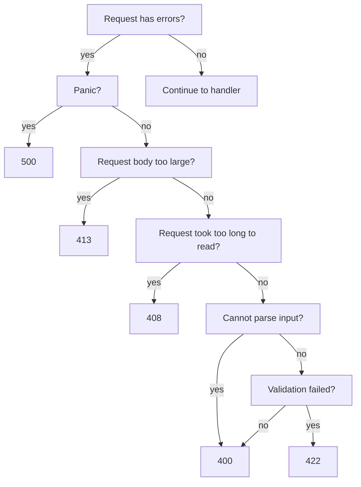
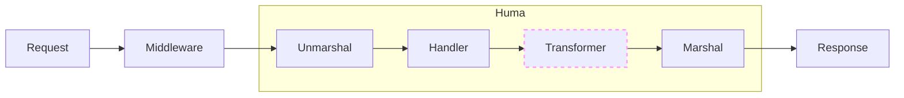

[](https://huma.rocks/) [](https://github.com/danielgtaylor/huma/actions?query=workflow%3ACI+branch%3Amain++) [](https://codecov.io/gh/danielgtaylor/huma) [](https://pkg.go.dev/github.com/danielgtaylor/huma/v2?tab=doc) [](https://goreportcard.com/report/github.com/danielgtaylor/huma/v2)

- [What is huma?](#intro)
- [Install](#install)
- [Example](#example)
- [Documentation](#documentation)

<a name="intro"></a>
A modern, simple, fast & flexible micro framework for building HTTP REST/RPC APIs in Go backed by OpenAPI 3 and JSON Schema. Pronounced IPA: [/'hjuːmɑ/](https://en.wiktionary.org/wiki/Wiktionary:International_Phonetic_Alphabet). The goals of this project are to provide:

- Incremental adoption for teams with existing services
  - Bring your own router, middleware, and logging/metrics
  - Extensible OpenAPI & JSON Schema layer to document existing routes
- A modern REST or HTTP RPC API backend framework for Go developers
  - Described by [OpenAPI 3.1](https://github.com/OAI/OpenAPI-Specification/blob/master/versions/3.1.0.md) & [JSON Schema](https://json-schema.org/)
- Guard rails to prevent common mistakes
- Documentation that can't get out of date
- High-quality generated developer tooling

Features include:

- Declarative interface on top of your router of choice:
  - Operation & model documentation
  - Request params (path, query, or header)
  - Request body
  - Responses (including errors)
  - Response headers
- JSON Errors using [RFC7807](https://tools.ietf.org/html/rfc7807) and `application/problem+json` by default (but can be changed)
- Per-operation request size limits with sane defaults
- [Content negotiation](https://developer.mozilla.org/en-US/docs/Web/HTTP/Content_negotiation) between server and client
  - Support for JSON ([RFC 8259](https://tools.ietf.org/html/rfc8259)) and CBOR ([RFC 7049](https://tools.ietf.org/html/rfc7049)) content types via the `Accept` header with the default config.
- Conditional requests support, e.g. `If-Match` or `If-Unmodified-Since` header utilities.
- Optional automatic generation of `PATCH` operations that support:
  - [RFC 7386](https://www.rfc-editor.org/rfc/rfc7386) JSON Merge Patch
  - [RFC 6902](https://www.rfc-editor.org/rfc/rfc6902) JSON Patch
  - [Shorthand](https://github.com/danielgtaylor/shorthand) patches
- Annotated Go types for input and output models
  - Generates JSON Schema from Go types
  - Static typing for path/query/header params, bodies, response headers, etc.
  - Automatic input model validation & error handling
- Documentation generation using [Stoplight Elements](https://stoplight.io/open-source/elements)
- Optional CLI built-in, configured via arguments or environment variables
  - Set via e.g. `-p 8000`, `--port=8000`, or `SERVICE_PORT=8000`
  - Startup actions & graceful shutdown built-in
- Generates OpenAPI for access to a rich ecosystem of tools
  - Mocks with [API Sprout](https://github.com/danielgtaylor/apisprout) or [Prism](https://stoplight.io/open-source/prism)
  - SDKs with [OpenAPI Generator](https://github.com/OpenAPITools/openapi-generator) or [oapi-codegen](https://github.com/deepmap/oapi-codegen)
  - CLI with [Restish](https://rest.sh/)
  - And [plenty](https://openapi.tools/) [more](https://apis.guru/awesome-openapi3/category.html)
- Generates JSON Schema for each resource using optional `describedby` link relation headers as well as optional `$schema` properties in returned objects that integrate into editors for validation & completion.

This project was inspired by [FastAPI](https://fastapi.tiangolo.com/). Logo & branding designed by Kari Taylor.

# Install

```sh
# After: go mod init ...
go get -u github.com/danielgtaylor/huma/v2
```

# Example

Here is a complete basic hello world example in Huma, that shows how to initialize a Huma app complete with CLI, declare a resource operation, and define its handler function.

```go
package main

import (
	"net/http"

	"github.com/danielgtaylor/huma/v2"
	"github.com/danielgtaylor/huma/adapters/humachi"
)

// Options for the CLI.
type Options struct {
	Port int `help:"Port to listen on" default:"8888"`
}

// GreetingInput represents the greeting operation request.
type GreetingInput struct {
	Name string `path:"name" doc:"Name to greet"`
}

// GreetingOutput represents the greeting operation response.
type GreetingOutput struct {
	Body struct {
		Message string `json:"message" doc:"Greeting message" example:"Hello, world!"`
	}
}

func main() {
	// Create a CLI app which takes a port option.
	cli := huma.NewCLI(func(hooks huma.Hooks, options *Options) {
		// Create a new router & API
		router := chi.NewMux()
		api := humachi.New(router, huma.DefaultConfig("My API", "1.0.0"))

		// Register GET /greeting/{name}
		huma.Register(api, huma.Operation{
			OperationID: "get-greeting",
			Summary:     "Get a greeting",
			Method:      http.MethodGet,
			Path:        "/greeting/{name}",
		}, func(ctx context.Context, input *GreetingInput) (*GreetingOutput, error) {
			resp := &GreetingOutput{}
			resp.Body.Message = fmt.Sprintf("Hello, %s!", input.Name)
			return resp, nil
		})

		// Tell the CLI how to start your router.
		hooks.OnStart(func() {
			http.ListenAndServe(fmt.Sprintf(":%d", options.Port), router)
		})
	})

	// Run the CLI. When passed no commands, it starts the server.
	cli.Run()
}
```

You can test it with `go run greet.go` (optionally pass `--port` to change the default) and make a sample request using [Restish](https://rest.sh/) (or `curl`):

```sh
# Get the message from the server
$ restish :8888/greeting/world
HTTP/1.1 200 OK
...
{
	$schema: "http://localhost:8888/schemas/GreetingOutputBody.json",
	message: "Hello, world!"
}
```

Even though the example is tiny you can also see some generated documentation at http://localhost:8888/docs. The generated OpenAPI is available at http://localhost:8888/openapi.json or http://localhost:8888/openapi.yaml.

# Documentation

Official Go package documentation can always be found at https://pkg.go.dev/github.com/danielgtaylor/huma/v2. Below is an introduction to the various features available in Huma.

> :whale: Hi there! I'm the happy Huma whale here to provide help. You'll see me leave helpful tips down below.

## BYOR (Bring Your Own Router)

Huma is designed to be router-agnostic to enable incremental adoption in existing and new services across a large number of organizations. This means you can use any router you want, or even write your own. The only requirement is and implementation of a small `huma.Adapter` interface. This is how Huma integrates with your router.

Adapters are in the `adapters` directory and named after the router they support. Many common routers are supported out of the box:

- [chi](https://github.com/go-chi/chi) via `humachi`
- [gin](https://gin-gonic.com/) via `humagin`
- [gorilla/mux](https://github.com/gorilla/mux) via `humamux`
- [httprouter](https://github.com/julienschmidt/httprouter) via `humahttprouter`
- [Fiber](https://gofiber.io/) via `humafiber`

Adapters are instantiated by wrapping your router and providing a Huma configuration object which describes the API. Here is a simple example using Chi:

```go
// Create your router.
app := chi.NewMux()

// Wrap the router with Huma to create an API instance.
api := humachi.New(app, huma.DefaultConfig("My API", "1.0.0"))

// Register your operations with the API.
// ...

// Start the server!
http.ListenAndServe(":8888", r)
```

> :whale: Writing your own adapter is quick and simple, and PRs are accepted for additional adapters to be built-in.

### Middleware

Huma v1 came with its own middleware, but v2 does not. You can use any middleware you want, or even write your own. This is for two reasons:

1. Middleware is often router-specific and Huma is designed to be router-agnostic.
2. Many organizations already have a set of middleware for logging, metrics, distributed tracing, panic recovery, etc.

> :whale: Huma v1 middleware is compatible with Chi, so if you use that router with v2 you can continue to use the v1 middleware in a v2 application.

## Open API Generation & Extensibility

Huma generates Open API 3.1.0 compatible JSON/YAML specs and provides rendered documentation automatically. Every operation that is registered with the API is included in the spec by default. The operation's inputs and outputs are used to generate the request and response parameters / schemas.

The API config controls where the OpenAPI, docs, and schemas are available. The default config uses `/openapi.json`, `/docs`, and `/schemas` respectively. You can change these to whatever you want, or disable them entirely by leaving them blank.

You may want to customize the generated Open API spec. With Huma v2 you have full access and can modify it as needed in the API configuration or when registering operations. For example, to set up a security scheme:

```go
config := huma.DefaultConfig("My API", "1.0.0")
config.Components.SecuritySchemes = map[string]*huma.SecurityScheme{
		"bearer": {
			Type: "http",
			Scheme: "bearer",
			BearerFormat: "JWT",
		},
	}
api := humachi.New(router, config)

huma.Register(api, huma.Operation{
	OperationID: "get-greeting",
	Method:      http.MethodGet,
	Path:        "/greeting/{name}",
	Summary:     "Get a greeting",
	Security: []map[string][]string{
		{"bearer": {}},
	},
}, func(ctx context.Context, input *GreetingInput) (*GreetingOutput, error) {
	// ...
})
```

> :whale: See the [OpenAPI 3.1 spec](https://github.com/OAI/OpenAPI-Specification/blob/main/versions/3.1.0.md) for everything that can be set and how it is expected to be used.

### OpenAPI Settings Composition

Because you have full access to the OpenAPI spec, you can compose it however you want and write convenience functions to make things more straightforward. The above example could be made easier to read:

```go
config := huma.DefaultConfig("My API", "1.0.0")
config = withBearerAuthScheme(config)

api := humachi.New(router, config)

huma.Register(api, withBearerAuth(huma.Operation{
	OperationID: "get-greeting",
	Method:      http.MethodGet,
	Path:        "/greeting/{name}",
	Summary:     "Get a greeting",
}), func(ctx context.Context, input *GreetingInput) (*GreetingOutput, error) {
	// ...
})
```

Set this up however you like. Even the `huma.Register` function can be wrapped by your organization to ensure that all operations are registered with the same settings.

### Custom OpenAPI Extensions

Custom extensions to the OpenAPI are supported via the `Extensions` field on most OpenAPI structs:

```go
config := huma.DefaultConfig("My API", "1.0.0")
config.Extensions = map[string]any{
	"my-extension": "my-value",
}
```

Anything in the `Extensions` map will be flattened during serialization so that its fields are peers with the `Extensions` peers in the OpenAPI spec. For example, the above would result in:

```json
{
  "openapi": "3.1.0",
  "info": {
    "title": "My API",
    "version": "1.0.0"
  },
  "my-extension": "my-value"
}
```

### JSON Schema

Using the default Huma config (or manually via the `huma.SchemaLinkTransformer`), each resource operation returns a `describedby` HTTP link relation header which references a JSON-Schema file. These schemas use the `config.SchemasPath` to the serve their content. For example:

```http
Link: </schemas/Note.json>; rel="describedby"
```

Object resources (i.e. not arrays or simple scalars) can also optionally return a `$schema` property with such a link, which enables the described-by relationship to outlive the HTTP request (i.e. saving the body to a file for later editing) and enables some editors like [VSCode](https://code.visualstudio.com/docs/languages/json#_mapping-in-the-json) to provide code completion and validation as you type.

```json
{
  "$schema": "http://localhost:8888/schemas/Note.json",
  "title": "I am a note title",
  "contents": "Example note contents",
  "labels": ["todo"]
}
```

Operations which accept objects as input will ignore the `$schema` property, so it is safe to submit back to the API, aka "round-trip" the data.

> :whale: The `$schema` field is incredibly powerful when paired with Restish's [edit](https://rest.sh/#/guide?id=editing-resources) command, giving you a quick and easy way to edit strongly-typed resources in your favorite editor.

### Schema Registry

Huma uses a customizable registry to keep track of all the schemas that have been generated from Go structs. This is used to avoid generating the same schema multiple times, and to provide a way to reference schemas by name for OpenAPI operations & hosted JSON Schemas.

The default schema implementation uses a `map` to store schemas by name,generated from the Go type name without the package name. This supports recursive schemas and generates simple names like `Thing` or `ThingList`. Note that by design it does **not** support multiple models with the same name in different packages.

You can create your own registry with custom behavior by implementing the `huma.Registry` interface and setting it on `config.Components.Schemas` when creating your API.

## Operations

Operations are at the core of Huma. They map an HTTP method verb and resource path to a handler function with well-defined inputs and outputs. Operations are created using the `huma.Register` function:

```go
huma.Register(api, huma.Operation{
	OperationID: "your-operation-name",
	Method:      http.MethodGet,
	Path:        "/path/to/resource/{id}",
	Summary:     "A short description of the operation",
}, func(ctx context.Context, input *YourInput) (*YourOutput, error) {
	// ... Implementation goes here ...
})
```

> :whale: If following REST-ish conventions, operation paths should be nouns, and plural if they return more than one item. Good examples: `/notes`, `/likes`, `/users/{user-id}`, `/videos/{video-id}/stats`, etc. Huma does not enforce this or care, so RPC-style paths are also fine to use. Use what works best for you and your team.

The operation handler function always has the following generic format, where `Input` and `Output` are custom structs defined by the developer that respresent the entirety of the request (path/query/header params & body) and response (headers & body), respectively:

```go
func(context.Context, *Input) (*Output, error)
```

There are many options available for configuring OpenAPI settings for the operation, and custom extensions are supported as well. See the `huma.Operation` struct for more details.

> :whale: Did you know? The `OperationID` is used to generate friendly CLI commands in [Restish](https://rest.sh/) and used when generating SDKs! It should be unique, descriptive, and easy to type.

### Input & Output Models

Inputs and outputs are **always** structs that represent the entirety of the incoming request or outgoing response. This is a deliberate design decision to make it easier to reason about the data flow in your application. It also makes it easier to share code as well as generate documentation and SDKs.

#### Request Model

Requests can have parameters and/or a body as input to the handler function. Inputs use standard Go structs with special fields and/or tags. Here are the available tags:

| Tag      | Description                        | Example                  |
| -------- | ---------------------------------- | ------------------------ |
| `path`   | Name of the path parameter         | `path:"thing-id"`        |
| `query`  | Name of the query string parameter | `query:"q"`              |
| `header` | Name of the header parameter       | `header:"Authorization"` |

The following parameter types are supported out of the box:

| Type                | Example Inputs         |
| ------------------- | ---------------------- |
| `bool`              | `true`, `false`        |
| `[u]int[16/32/64]`  | `1234`, `5`, `-1`      |
| `float32/64`        | `1.234`, `1.0`         |
| `string`            | `hello`, `t`           |
| `time.Time`         | `2020-01-01T12:00:00Z` |
| slice, e.g. `[]int` | `1,2,3`, `tag1,tag2`   |

For example, if the parameter is a query param and the type is `[]string` it might look like `?tags=tag1,tag2` in the URI.

The special struct field `Body` will be treated as the input request body and can refer to any other type or you can embed a struct or slice inline. Using `[]byte` as the `Body` type will bypass parsing and validation completely. `RawBody []byte` can also be used alongside `Body` to provide access to the `[]byte` used to validate & parse `Body`.

Example:

```go
type MyInput struct {
	ID      string `path:"id"`
	Detail  bool   `query:"detail" doc:"Show full details"`
	Auth    string `header:"Authorization"`
	Body    MyBody
	RawBody []byte
}
```

A request to such an endpoint might look like:

```sh
# Via high-level operations:
$ restish api my-op 123 --detail=true --authorization=foo <body.json

# Via URL:
$ restish api/my-op/123?detail=true -H "Authorization: foo" <body.json
```

#### Validation

Go struct tags are used to annotate inputs/output structs with information that gets turned into [JSON Schema](https://json-schema.org/) for documentation and validation.

The standard `json` tag is supported and can be used to rename a field and mark fields as optional using `omitempty`. The following additional tags are supported on model fields:

| Tag                | Description                               | Example                  |
| ------------------ | ----------------------------------------- | ------------------------ |
| `doc`              | Describe the field                        | `doc:"Who to greet"`     |
| `format`           | Format hint for the field                 | `format:"date-time"`     |
| `enum`             | A comma-separated list of possible values | `enum:"one,two,three"`   |
| `default`          | Default value                             | `default:"123"`          |
| `minimum`          | Minimum (inclusive)                       | `minimum:"1"`            |
| `exclusiveMinimum` | Minimum (exclusive)                       | `exclusiveMinimum:"0"`   |
| `maximum`          | Maximum (inclusive)                       | `maximum:"255"`          |
| `exclusiveMaximum` | Maximum (exclusive)                       | `exclusiveMaximum:"100"` |
| `multipleOf`       | Value must be a multiple of this value    | `multipleOf:"2"`         |
| `minLength`        | Minimum string length                     | `minLength:"1"`          |
| `maxLength`        | Maximum string length                     | `maxLength:"80"`         |
| `pattern`          | Regular expression pattern                | `pattern:"[a-z]+"`       |
| `minItems`         | Minimum number of array items             | `minItems:"1"`           |
| `maxItems`         | Maximum number of array items             | `maxItems:"20"`          |
| `uniqueItems`      | Array items must be unique                | `uniqueItems:"true"`     |
| `minProperties`    | Minimum number of object properties       | `minProperties:"1"`      |
| `maxProperties`    | Maximum number of object properties       | `maxProperties:"20"`     |
| `example`          | Example value                             | `example:"123"`          |
| `readOnly`         | Sent in the response only                 | `readOnly:"true"`        |
| `writeOnly`        | Sent in the request only                  | `writeOnly:"true"`       |
| `deprecated`       | This field is deprecated                  | `deprecated:"true"`      |

Parameters have some additional validation tags:

| Tag      | Description                       | Example         |
| -------- | --------------------------------- | --------------- |
| `hidden` | Hide parameter from documentation | `hidden:"true"` |

#### Resolvers

Sometimes the built-in validation isn't sufficient for your use-case, or you want to do something more complex with the incoming request object. This is where resolvers come in.

Any input struct can be a resolver by implementing the `huma.Resolver` or `huma.ResolverWithPath` interface, including embedded structs. Each resolver takes the current context and can return a list of exhaustive errors. For example:

```go
// MyInput demonstrates inputs/transformation
type MyInput struct {
	Host   string
	Name string `query:"name"`
}

func (m *MyInput) Resolve(ctx huma.Context) []error {
	// Get request info you don't normally have access to.
	m.Host = ctx.Host()

	// Transformations or other data validation
	m.Name = strings.Title(m.Name)

	return nil
}

// Then use it like any other input struct:
huma.Register(api, huma.Operation{
	OperationID: "list-things",
	Method:      http.MethodGet,
	Path:        "/things",
	Summary:     "Get a filtered list of things",
}, func(ctx context.Context, input *MyInput) (*YourOutput, error) {
	fmt.Printf("Host: %s\n", input.Host)
	fmt.Printf("Name: %s\n", input.Name)
})
```

It is recommended that you do not save the context object passed to the `Resolve` method for later use.

For deeply nested structs within the request body, you may not know the current location of the field being validated (e.g. it may appear in multiple places or be shared by multiple request objects). The `huma.ResolverWithPath` interface provides a path prefix that can be used to generate the full path to the field being validated. It uses a `huma.PathBuffer` for efficient path generation reusing a shared buffer. For example:

```go
func (m *MyInput) Resolve(ctx huma.Context, prefix *huma.PathBuffer) []error {
	return []error{&huma.ErrorDetail{
		Message: "Foo has a bad value",
		Location: prefix.With("foo")
		Value: m.Foo,
	}}
}
```

> :whale: Prefer using built-in validation over resolvers whenever possible, as it will be better documented and is also usable by OpenAPI tooling to provide a better developer experience.

##### Resolver Errors

Resolvers can set errors as needed and Huma will automatically return a 400-level error response before calling your handler. This makes resolvers a good place to run additional complex validation steps so you can provide the user with a set of exhaustive errors.

```go
type MyInput struct {
	Host   string
}

func (m *MyInput) Resolve(ctx huma.Context) []error {
	if m.Host = ctx.Host(); m.Host == "localhost" {
		return []error{&huma.ErrorDetail{
			Message: "Unsupported host value!",
			Location: "request.host",
			Value: m.Host,
		}}
	}
	return nil
}
```

> :whale: Exhaustive errors lessen frustration for users. It's better to return three errors in response to one request than to have the user make three requests which each return a new different error.

#### Input Composition

Because inputs are just Go structs, they are composable and reusable. For example:

```go
type AuthParam struct {
	Authorization string `header:"Authorization"`
}

type PaginationParams struct {
	Cursor string `query:"cursor"`
	Limit  int    `query:"limit"`
}

// ... Later in the code
huma.Register(api, huma.Operation{
	OperationID: "list-things",
	Method:      http.MethodGet,
	Path:        "/things",
	Summary:     "Get a filtered list of things",
}, func(ctx context.Context, input struct {
	// Embed both structs to compose your input.
	AuthParam
	PaginationParams
}) {
	fmt.Printf("Auth: %s, Cursor: %s, Limit: %d\n", input.Authorization, input.Cursor, input.Limit)
}
```

#### Request Deadlines & Timeouts

A combination of the server and the request context can be used to control deadlines & timeouts. Go's built-in HTTP server supports a few timeout settings:

```go
srv := &http.Server{
	ReadTimeout:       5 * time.Second,
	WriteTimeout:      5 * time.Second,
	IdleTimeout:       30 * time.Second,
	ReadHeaderTimeout: 2 * time.Second,
	// ...
}
```

The Huma request context (accessible via resolvers) can be used to set a read deadline, which can be used to process large or streaming inputs:

```go
type MyInput struct {}

func (m *MyInput) Resolve(ctx huma.Context) []error {
	ctx.SetReadDeadline(time.Now().Add(5 * time.Second))
}
```

Additionally, a `context.Context` can be used to set a deadline for dependencies like databases:

```go
// Create a new context with a 10 second timeout.
newCtx, cancel := context.WithTimeout(ctx, 10 * time.Second)
defer cancel()

// Use the new context for any dependencies.
result, err := myDB.Get(newCtx, /* ... */)
if err != nil {
	// Deadline may have been hit, handle it here!
}
```

#### Request Body Size Limits

By default each operation has a 1 MiB reqeuest body size limit. This can be changed by setting `huma.Operation.MaxBodyBytes` to a different value when registering the operation. If the request body is larger than the limit then a `413 Request Entity Too Large` error will be returned.

#### Response Model

Responses can have an optional status code, headers, and/or body. Like inputs, they use standard Go structs. Here are the available tags:

| Tag      | Description                 | Example                  |
| -------- | --------------------------- | ------------------------ |
| `header` | Name of the response header | `header:"Authorization"` |

The special struct field `Status` with a type of `int` is used to optionally communicate a **dynamic** response status code from the handler (you should not need this most of the time!). If not present, the default is to use `200` for responses with bodies and `204` for responses without a body. Use `huma.Operation.DefaultStatus` at operation registration time to override. Note: it is much more common to set the default status code than to need a `Status` field in your response struct!

The special struct field `Body` will be treated as the response body and can refer to any other type or you can embed a struct or slice inline. Use a type of `[]byte` to bypass serialization. A default `Content-Type` header will be set if none is present, selected via client-driven content negotiation with the server based on the registered serialization types.

Example:

```go
type MyOutput struct {
	Status       int
	LastModified time.Time `header:"Last-Modified"`
	Body         MyBody
}
```

#### Streaming Responses

The response `Body` can also be a callback function taking a `huma.Context` to facilitate streaming. The `huma.StreamResponse` utility makes this easy to return:

```go
func handler(ctx context.Context, input *MyInput) (*huma.StreamResponse, error) {
	return &huma.StreamResponse{
		Body: func(ctx huma.Context) {
			// Write header info before streaming the body.
			ctx.SetHeader("Content-Type", "text/my-stream")
			writer := ctx.BodyWriter()

			// Update the write deadline to give us extra time.
			if d, ok := bw.(interface{ SetWriteDeadline(time.Time) error }); ok {
				d.SetWriteDeadline(time.Now().Add(5 * time.Second))
			} else {
				fmt.Println("warning: unable to set write deadline")
			}

			// Write the first message, then flush and wait.
			writer.Write([]byte("Hello, I'm streaming!"))
			if f, ok := writer.(http.Flusher); ok {
				f.Flush()
			} else {
				fmt.Println("error: unable to flush")
			}

			time.Sleep(3 * time.Second)

			// Write the second message.
			writer.Write([]byte("Hello, I'm still streaming!"))
		},
	}, nil
}
```

Also take a look at [`http.ResponseController`](https://pkg.go.dev/net/http#ResponseController) which can be used to set timeouts, flush, etc in one simple interface.

> :whale: The `sse` package provides a helper for streaming Server-Sent Events (SSE) responses that is easier to use than the above example!

### Exhaustive Errors

Errors use [RFC 7807](https://tools.ietf.org/html/rfc7807) and return a structure that looks like:

```json
{
  "status": 504,
  "title": "Gateway Timeout",
  "detail": "Problem with HTTP request",
  "errors": [
    {
      "message": "Get \"https://httpstat.us/418?sleep=5000\": context deadline exceeded"
    }
  ]
}
```

The `errors` field is optional and may contain more details about which specific errors occurred.

It is recommended to return exhaustive errors whenever possible to prevent user frustration with having to keep retrying a bad request and getting back a different error. Input parameters validation, body validation, resolvers, etc all support returning exhaustive errors.

While every attempt is made to return exhaustive errors within Huma, each individual response can only contain a single HTTP status code. The following chart describes which codes get returned and when:



This means it is possible to, for example, get an HTTP `408 Request Timeout` response that _also_ contains an error detail with a validation error for one of the input headers. Since request timeout has higher priority, that will be the response status code that is returned.

### Response Transformers

Router middleware operates on router-specific request & response objects whose bodies are `[]byte` slices or streams. Huma operations operate on specific struct instances. Sometimes there is a need to generically operate on structured response data _after_ the operation handler has run but _before_ the response is serialized to bytes. This is where response transformers come in.



Response transformers enable you to modify the response on the fly. For example, you could add a `Link` header to the response to indicate that the response body is described by a JSON Schema. This is done by implementing the `huma.Transformer` interface and registering it with the API. See the `huma.SchemaLinkTransformer` for an example.

### Serialization Formats

Huma supports custom serialization formats by implementing the `huma.Format` interface. Serialization formats are set on the API configuration at API creation time and selected by client-driven content negotiation using the `Accept` or `Content-Type` headers. The `config.Formats` maps either a content type name or extension (suffix) to a `huma.Format` instance.

The default configuration for Huma includes support for JSON ([RFC 8259](https://tools.ietf.org/html/rfc8259)) and CBOR ([RFC 7049](https://tools.ietf.org/html/rfc7049)) content types via the `Accept` header. This is done by registering the following content types using `huma.DefaultJSONFormat` & `huma.DefaultCBORFormat`:

- `application/json`
- Anything ending with `+json`
- `application/cbor`
- Anything ending with `+cbor`

> :whale: You can easily add support for additional serialization formats, including binary formats like Protobuf if desired.

#### Content Negotiation

Content negotiation allows clients to select the content type they are most comfortable working with when talking to the API. For request bodies, this uses the `Content-Type` header. For response bodies, it uses the `Accept` header. If none are present then JSON is usually selected as the default / preferred content type.

See the `negotiation` package for more info.

## CLI

Huma ships with a built-in lightweight utility to wrap your service with a CLI, enabling you to run it with different arguments and easily write custom commands to do things like print out the OpenAPI or run on-demand database migrations.

The CLI options use a similar strategy to input & output structs, enabling you to use the same pattern for validation and documentation of command line arguments. It uses Cobra & Viper under the hood, enabling automatic environment variable binding and more.

```go
// First, define your input options.
type Options struct {
	Debug bool   `doc:"Enable debug logging"`
	Host  string `doc:"Hostname to listen on."`
	Port  int    `doc:"Port to listen on." short:"p" default:"8888"`
}

func main() {
	// Then, create the CLI.
	cli := huma.NewCLI(func(hooks huma.Hooks, opts *Options) {
		fmt.Printf("I was run with debug:%v host:%v port%v\n",
			opts.Debug, opts.Host, opts.Port)
	})

	// Run the thing!
	cli.Run()
}
```

You can then run the CLI with and see the results:

```sh
$ go run main.go
I was run with debug:false host: port:8888
```

To do useful work, you will want to register a handler for the default start command and optionally a way to gracefully shutdown the server:

```go
cli.OnStart(func() {
	// Start your server here
	http.ListenAndServe(
		fmt.Sprintf("%s:%d", options.Host, options.Port), myRouter
	)
})

cli.OnStop(func() {
	// Gracefully shutdown your server here
	// ...
})
```

### Custom Options

Custom options are defined by adding to your options struct. The following types are supported:

| Type            | Example Inputs                    |
| --------------- | --------------------------------- |
| `bool`          | `true`, `false`                   |
| `int` / `int64` | `1234`, `5`, `-1`                 |
| `string`        | `prod`, `http://api.example.tld/` |

The following struct tags are available:

| Tag       | Description                             | Example              |
| --------- | --------------------------------------- | -------------------- |
| `default` | Default value (parsed automatically)    | `default:"123"`      |
| `doc`     | Describe the option                     | `doc:"Who to greet"` |
| `short`   | Single letter short name for the option | `short:"p"` for `-p` |

### Custom Commands

You can access the root `cobra.Command` via `cli.Root()` and add new custom commands via `cli.Root().AddCommand(...)`. For example, to have a command print out the generated OpenAPI:

```go
var api huma.API

// ... set up the CLI, create the API wrapping the router ...

cli.Root().AddCommand(&cobra.Command{
	Use:   "openapi",
	Short: "Print the OpenAPI spec",
	Run: func(cmd *cobra.Command, args []string) {
		b, _ := yaml.Marshal(api.OpenAPI())
		fmt.Println(string(b))
	},
})
```

Now you can run your service and use the new command: `go run main.go openapi`.

If you want to access your custom options struct with custom commands, use the `huma.WithOptions(func(cmd *cobra.Command, args []string, options *YourOptions)) func(cmd *cobra.Command, args []string)` utitity function. It ensures the options are parsed and available before running your command.

> :whale: You can also overwite `cli.Root().Run` to completely customize how you run the server. Or just ditch the `cli` package altogether!

## Additional Features

### Conditional Requests

There are built-in utilities for handling [conditional requests](https://developer.mozilla.org/en-US/docs/Web/HTTP/Conditional_requests), which serve two broad purposes:

1. Sparing bandwidth on reading a document that has not changed, i.e. "only send if the version is different from what I already have"
2. Preventing multiple writers from clobbering each other's changes, i.e. "only save if the version on the server matches what I saw last"

Adding support for handling conditional requests requires four steps:

1. Import the `github.com/danielgtaylor/huma/conditional` package.
2. (optional) Add the response definition (`304 Not Modified` for reads or `412 Precondition Failed` for writes)
3. Add `conditional.Params` to your input struct.
4. Check if conditional params were passed and handle them. The `HasConditionalParams()` and `PreconditionFailed(...)` methods can help with this.

Implementing a conditional read might look like:

```go
huma.Register(api, huma.Operation{
	OperationID: "get-resource",
	Method:      http.MethodGet,
	Path:        "/resource",
	Summary:     "Get a resource",
}, func(ctx context.Context, input struct {
	conditional.Params
}) (*YourOutput, error) {
	if input.HasConditionalParams() {
		// TODO: Get the ETag and last modified time from the resource.
		etag := ""
		modified := time.Time{}

		// If preconditions fail, abort the request processing. Response status
		// codes are already set for you, but you can optionally provide a body.
		// Returns an HTTP 304 not modified.
		if err := input.PreconditionFailed(etag, modified); err != nil {
			return err
		}

		// Otherwise do the normal request processing here...
		// ...
	}
})
```

> :whale: Note that it is more efficient to construct custom DB queries to handle conditional requests, however Huma is not aware of your database. The built-in conditional utilities are designed to be generic and work with any data source, and are a quick and easy way to get started with conditional request handling.

### Auto Patch Operations

If a `GET` and a `PUT` exist for the same resource, but no `PATCH` exists at server start up, then a `PATCH` operation can be generated for you to make editing more convenient for clients. You can opt-in to this behavior with the `autopatch` package:

```go
import "github.com/danielgtaylor/huma/autopatch"

// ...

// Later in the code *after* registering operations...
autopatch.AutoPatch(api)
```

If the `GET` returns an `ETag` or `Last-Modified` header, then these will be used to make conditional requests on the `PUT` operation to prevent distributed write conflicts that might otherwise overwrite someone else's changes.

The following formats are supported out of the box, selected via the `Content-Type` header:

- [JSON Merge Patch](https://datatracker.ietf.org/doc/html/rfc7386) `application/merge-patch+json`
- [Shorthand Merge Patch](https://rest.sh/#/shorthand?id=patch-partial-update) `application/merge-patch+shorthand`
- [JSON Patch](https://www.rfc-editor.org/rfc/rfc6902.html) `application/json-patch+json`

If the `PATCH` request has no `Content-Type` header, or uses `application/json` or a variant thereof, then JSON Merge Patch is assumed.

> :whale: You can think of the Shorthand Merge Patch as an extension to the JSON merge patch with support for field paths, arrays, and a few other features. Patches like this are possible, appending an item to an array (creating it if needed):
>
> ```
> {
>   foo.bar[]: "baz",
> }
> ```

## Server Sent Events (SSE)

The `sse` package provides a helper for streaming Server-Sent Events (SSE) responses. It provides a simple API for sending events to the client and documents the event types and data structures in the OpenAPI spec if you provide a mapping of message type names to Go structs:

```go
// Register using sse.Register instead of huma.Register
sse.Register(api, huma.Operation{
	OperationID: "sse",
	Method:      http.MethodGet,
	Path:        "/sse",
	Summary:     "Server sent events example",
}, map[string]any{
	// Mapping of event type name to Go struct for that event.
	"message":      DefaultMessage{},
	"userCreate":   UserCreatedEvent{},
	"mailRecieved": MailReceivedEvent{},
}, func(ctx context.Context, input *struct{}, send func(sse.Message) error) {
	// Send an event every second for 10 seconds.
	for x := 0; x < 10; x++ {
		send.Data(MailReceivedEvent{UserID: "abc123"})
		time.Sleep(1 * time.Second)
	}
})
```

> :whale: Each event model **must** be a unique Go type. If you want to reuse Go type definitions, you can define a new type referencing another type, e.g. `type MySpecificEvent MyBaseEvent` and it will work as expected.

## CLI AutoConfig

Huma includes built-in support for an OpenAPI 3 extension that enables CLI autoconfiguration. This allows tools like [Restish](https://rest.sh/) to automatically configure themselves to talk to your API with the correct endpoints, authentication mechanism, etc without the user needing to know anything about your API.

```go
o := api.OpenAPI()
o.Components.SecuritySchemes["my-scheme"] = &huma.SecurityScheme{
	Type: "oauth2",
	// ... security scheme definition ...
}
o.Extensions["x-cli-autoconfig"] = huma.AutoConfig{
	Security: "my-scheme",
	Params: map[string]string{
		"cliend_id": "abc123",
		"authorize_url": "https://example.tld/authorize",
		"token_url": "https://example.tld/token",
		"scopes": "read,write",
	}
}
```

See the [CLI AutoConfiguration](https://rest.sh/#/openapi?id=autoconfiguration) documentation for more info, including how to ask the user for custom parameters.

## Low-Level API

Huma v2 is written so that you can use the low-level API directly if you want to. This is useful if you want to add some new feature or abstraction that Huma doesn't support out of the box. Huma's own `huma.Register` function, automatic HTTP `PATCH` handlers, and the `sse` package are all built on top of the public low-level API.

### `huma.Adapter`

The adapter is the core of Huma's bring-your-own-router functionality. It is an abstraction on top of routers and HTTP libraries that operates on a generic `huma.Context` described below. The adapter interface is simple and allows registering operation handlers and serving standard library HTTP requests:

```go
type Adapter interface {
	Handle(op *Operation, handler func(ctx Context))
	ServeHTTP(http.ResponseWriter, *http.Request)
}
```

### `huma.Context`

The context provides a generic HTTP layer which is translated into specific router operations when called by the adapter.

```go
type Context interface {
	Operation() *Operation
	Context() context.Context
	Method() string
	Host() string
	URL() url.URL
	Param(name string) string
	Query(name string) string
	Header(name string) string
	EachHeader(cb func(name, value string))
	BodyReader() io.Reader
	SetReadDeadline(time.Time) error
	SetStatus(code int)
	SetHeader(name, value string)
	AppendHeader(name, value string)
	BodyWriter() io.Writer
}
```

### `huma.Register`

The `huma.Register` function is a highly-optimized wrapper around the low-level API that handles all the OpenAPI generation, validation, and serialization for you. It is a good example of how to use the low-level API. At a high level it does the following:

1. Adds OpenAPI descriptions of the operation to the OpenAPI spec
1. Registers an operation handler with the adapter
   1. Reads request parameters (`ctx.Param`, `ctx.Query`, `ctx.Header`)
   1. Parses request body if present (`ctx.BodyReader`)
   1. Calls the user's handler function with all inputs
   1. Handles errors returned from the handler by writing to the `ctx`
   1. Writes success response (`ctx.SetStatus`, `ctx.SetHeader`, `ctx.BodyWriter`)

> :whale: Because `huma.Register` uses only the _public_ interfaces of the low-level API, you can easily wrap it or write your own register function to provide new functionality.

## Migrating from Huma v1

1. Import `github.com/danielgtaylor/huma/v2` instead of `github.com/danielgtaylor/huma`.
1. Use the `humachi` adapter as v1 uses Chi under the hood
1. Attach your middleware to the `chi` instance.
1. Replace resource & operation creation with `huma.Register`
1. Rewrite handlers to be like `func(context.Context, *Input) (*Output, error)`
   1. Return errors instead of `ctx.WriteError(...)`
   1. Return instances instead of `ctx.WriteModel(...)`
1. Define options via a struct and use `huma.NewCLI` to wrap the service

Note that GraphQL support from Huma v1 has been removed. Take a look at alternative tools like https://www.npmjs.com/package/openapi-to-graphql which will automatically generate a GraphQL endpoint from Huma's generated OpenAPI spec.

## Benchmarks

Significant performance improvements have been made since Huma v1, as shown by the following basic benchmark operation with a few input parameters, a small input body, some output headers and an output body (see `adapters/humachi/humachi_test.go`).

```sh
# Huma v1
BenchmarkHumaV1Chi-10         16285  112086 ns/op  852209 B/op  258 allocs/op

# Huma v2
BenchmarkHumaV2ChiNormal-10  431028    2777 ns/op    1718 B/op   29 allocs/op

# Chi without Huma (raw)
BenchmarkRawChi-10           552764    2143 ns/op    2370 B/op   29 allocs/op
```

These improvements are due to a number of factors, including changes to the Huma API, precomputation of reflection data when possible, low or zero-allocation validation & URL parsing, using shared buffer pools to limit garbage collector pressure, and more.

Since you bring your own router, you are free to "escape" Huma by using the router directly, but as you can see above it's rarely needed with v2.

> :whale: Thanks for reading!
