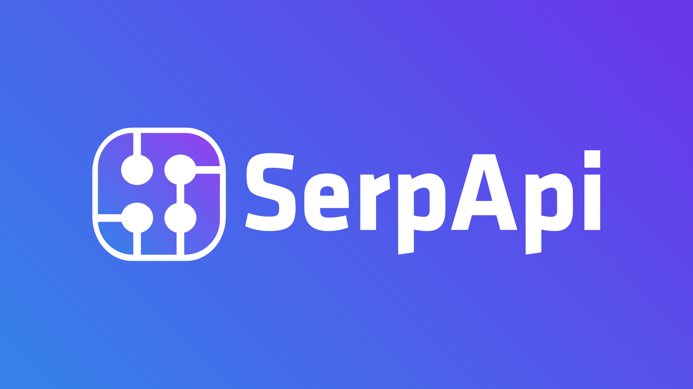

<a href="#">
  <picture>
    <source media="(prefers-color-scheme: dark)" srcset="https://huma.rocks/huma-dark.png" />
    <source media="(prefers-color-scheme: light)" srcset="https://huma.rocks/huma.png" />
    
  </picture>
</a>

[](https://huma.rocks/)
[](https://github.com/danielgtaylor/huma/actions?query=workflow%3ACI+branch%3Amain++)
[](https://codecov.io/gh/danielgtaylor/huma)
[](https://pkg.go.dev/github.com/danielgtaylor/huma/v2?tab=doc)
[](https://goreportcard.com/report/github.com/danielgtaylor/huma/v2)

[**🌎English Documentation**](./README.md)
[**🌎中文文档**](./README_CN.md)

- [Humaとは](#humaとは)
- [インストール方法](#インストール方法)
- [サンプル](#サンプル)
- [ドキュメント](#ドキュメント)

---

## Humaとは

**Huma**（発音: [/'hjuːmɑ/](https://en.wiktionary.org/wiki/Wiktionary:International_Phonetic_Alphabet)）は、OpenAPI 3とJSON Schemaをバックエンドに持つ、Go言語向けのモダンでシンプルかつ高速・柔軟なHTTP REST/RPC API構築用マイクロフレームワークです。

本プロジェクトの主な目的は以下の通りです：

- 既存サービスを持つチーム向けの段階的な導入
  - 好きなルーター（Go 1.22+対応含む）、ミドルウェア、ロギング/メトリクスを利用可能
  - 既存ルートをドキュメント化できる拡張性の高いOpenAPI & JSON Schemaレイヤ
- Go開発者のためのモダンなREST/HTTP RPC APIバックエンドフレームワーク
  - [OpenAPI 3.1](https://github.com/OAI/OpenAPI-Specification/blob/master/versions/3.1.0.md) & [JSON Schema](https://json-schema.org/)によるAPI記述
- よくあるミスを防止するガードレール
- ドキュメントと実装の乖離を防ぐ
- 高品質な開発者向けツール群の自動生成

主な機能

- 任意のルーター上で宣言的なインターフェースを提供
  - オペレーションやモデルのドキュメント生成
  - リクエストパラメータ（パス、クエリ、ヘッダー、Cookie）
  - リクエストボディ
  - レスポンス（エラー含む）とレスポンスヘッダー
- JSONエラーは[RFC9457](https://datatracker.ietf.org/doc/html/rfc9457)および`application/problem+json`（デフォルト、変更可）に準拠
- 各オペレーションごとにリクエストサイズの制限（安全なデフォルト値）
- [コンテンツネゴシエーション](https://developer.mozilla.org/ja/docs/Web/HTTP/Content_negotiation)に対応
  - デフォルト設定でJSON（[RFC 8259](https://tools.ietf.org/html/rfc8259)）と、オプションでCBOR（[RFC 7049](https://tools.ietf.org/html/rfc7049)）を`Accept`ヘッダーで選択可能
- `If-Match`や`If-Unmodified-Since`等の条件付きリクエストヘッダーをサポート
- 自動`PATCH`オペレーション生成（オプション）
  - [RFC 7386](https://www.rfc-editor.org/rfc/rfc7386) JSON Merge Patch
  - [RFC 6902](https://www.rfc-editor.org/rfc/rfc6902) JSON Patch
  - [Shorthand](https://github.com/danielgtaylor/shorthand)パッチ
- 入出力モデルのGo型にアノテーションを付与
  - Go型からJSON Schemaを自動生成
  - パス/クエリ/ヘッダー/ボディ/レスポンスヘッダー等の静的型付け
  - 入力モデルの自動バリデーション＆エラーハンドリング
- [Stoplight Elements](https://stoplight.io/open-source/elements)によるドキュメント生成
- 組み込みCLI（引数や環境変数で設定可能）
  - 例: `-p 8000`, `--port=8000`, `SERVICE_PORT=8000`
  - 起動時アクション＆グレースフルシャットダウン
- OpenAPI生成によりエコシステムの多彩なツールにアクセス可能
  - [API Sprout](https://github.com/danielgtaylor/apisprout), [Prism](https://stoplight.io/open-source/prism)でのモック
  - [OpenAPI Generator](https://github.com/OpenAPITools/openapi-generator), [oapi-codegen](https://github.com/deepmap/oapi-codegen)でのSDK生成
  - [Restish](https://rest.sh/)等CLIツール
  - [その他多数](https://openapi.tools/), [awesome-openapi3](https://apis.guru/awesome-openapi3/category.html)
- `describedby`リンクヘッダーや返却オブジェクト内の`$schema`プロパティ等で各リソースのJSON Schemaを生成し、エディタでのバリデーションや補完と連携可能

このプロジェクトは[FastAPI](https://fastapi.tiangolo.com/)にインスパイアされており、ロゴとブランディングはKari Taylor氏によってデザインされました。

---

## スポンサー

ご支援いただいたスポンサーの皆様に心より感謝いたします！

<div>
  
  <a href="https://serpapi.com/?utm_source=huma">
    
  </a>
  <h3>SerpApi: Web Search API</h3>
  <p>
    Access Google Search, Maps, Shopping, and other search engine data with a simple API by SerpApi.
  </p>
  <a href="https://serpapi.com/?utm_source=huma">Learn more</a>
</div>
<hr/>

- [@bclements](https://github.com/bclements)
- [@bekabaz](https://github.com/bekabaz)
- [@victoraugustolls](https://github.com/victoraugustolls)
- [@phoenixtechnologies-io](https://github.com/phoenixtechnologies-io)
- [@chenjr0719](https://github.com/chenjr0719)
- [@vinogradovkonst](https://github.com/vinogradovkonst)
- [@miyamo2](https://github.com/miyamo2)
- [@nielskrijger](https://github.com/nielskrijger)

---

## ユーザーの声

> 「GoのWebフレームワークの中で断然好き。FastAPIから影響を受けていて、機能も素晴らしいし、まだシンプルに使える。他のフレームワークだとイマイチしっくりこなかったけど、Humaは違う！」
> — [Jeb_Jenky](https://www.reddit.com/r/golang/comments/zhitcg/comment/izmg6vk/?utm_source=reddit&utm_medium=web2x&context=3)

> 「#Golang歴1年でHumaに出会った。まさに#FastAPIインスパイアのWebフレームワーク。ずっとこれを探してた！」
> — [Hana Mohan](https://twitter.com/unamashana/status/1733088066053583197)

> 「Huma最高です！素晴らしいパッケージをありがとうございます。長く使っていますが、本当に助かっています。」
> — [plscott](https://www.reddit.com/r/golang/comments/1aoshey/comment/kq6hcpd/?utm_source=reddit&utm_medium=web2x&context=3)

> 「Humaに感謝します。OpenAPI生成が特に便利で、FastAPIのように使えて工数も大幅に削減できました。」
> — [WolvesOfAllStreets](https://www.reddit.com/r/golang/comments/1aqj99d/comment/kqfqcml/?utm_source=reddit&utm_medium=web2x&context=3)

> 「Huma素晴らしいです。最近使い始めましたが、開発が楽しいです。努力に感謝します。」
> — [callmemicah](https://www.reddit.com/r/golang/comments/1b32ts4/comment/ksvr9h7/?utm_source=reddit&utm_medium=web2x&context=3)

> 「Python（FastAPI, SQL Alchemy）で3ヶ月かかったプラットフォームを、Go（Huma, SQL C）だと3週間で書き直せた。デバッグの時間も大幅減！」
> — [Bitclick\_](https://www.reddit.com/r/golang/comments/1cj2znb/comment/l2e4u6y/)

> 「Humaは、標準mux/chi上の良い薄いレイヤーで、自動のボディ＆パラメータシリアライズ。dotnet Web APIのような気持ち良さもありつつ、リクエスト/レスポンスの構造体設計をちゃんと意識できるのが最高。」
> — [Kirides](https://www.reddit.com/r/golang/comments/1fnn5c2/comment/lokuvpo/)

---

## インストール方法

`go get`でインストールできます。Go 1.25以降が必要です。

```sh
# 事前に: go mod init ...
go get -u github.com/danielgtaylor/huma/v2
```

---

## サンプル

以下はHumaを使った最小限のHello Worldサンプルです。CLI付きのHumaアプリの初期化、リソースオペレーション宣言、ハンドラー定義方法を示しています。

```go
package main

import (
	"context"
	"fmt"
	"net/http"

	"github.com/danielgtaylor/huma/v2"
	"github.com/danielgtaylor/huma/v2/adapters/humachi"
	"github.com/danielgtaylor/huma/v2/humacli"
	"github.com/go-chi/chi/v5"

	_ "github.com/danielgtaylor/huma/v2/formats/cbor"
)

// CLIオプション
type Options struct {
	Port int `help:"Port to listen on" short:"p" default:"8888"`
}

// greetingオペレーションのレスポンス
type GreetingOutput struct {
	Body struct {
		Message string `json:"message" example:"Hello, world!" doc:"Greeting message"`
	}
}

func main() {
	cli := humacli.New(func(hooks humacli.Hooks, options *Options) {
		router := chi.NewMux()
		api := humachi.New(router, huma.DefaultConfig("My API", "1.0.0"))

		huma.Get(api, "/greeting/{name}", func(ctx context.Context, input *struct{
			Name string `path:"name" maxLength:"30" example:"world" doc:"Name to greet"`
		}) (*GreetingOutput, error) {
			resp := &GreetingOutput{}
			resp.Body.Message = fmt.Sprintf("Hello, %s!", input.Name)
			return resp, nil
		})

		hooks.OnStart(func() {
			http.ListenAndServe(fmt.Sprintf(":%d", options.Port), router)
		})
	})

	cli.Run()
}
```

> **TIP:**
> Go 1.22 以降の標準ライブラリルーターを使う場合は、`chi.NewMux()` → `http.NewServeMux()`、`humachi.New` → `humago.New`に変更してください。`go.mod`の`go`バージョンも1.22以上にする必要があります。それ以外は同じです。

サーバー起動例:
`go run greet.go`（ポート指定は`--port`でも可）

[Restish](https://rest.sh/)や`curl`でテストできます：

```sh
# サーバーからメッセージを取得
$ restish :8888/greeting/world
HTTP/1.1 200 OK
...
{
	$schema: "http://localhost:8888/schemas/GreetingOutputBody.json",
	message: "Hello, world!"
}
```

このシンプルな例でも、http://localhost:8888/docs で自動生成ドキュメント、http://localhost:8888/openapi.json や http://localhost:8888/openapi.yaml でOpenAPI仕様が確認できます。

[Humaチュートリアル（インストール編）](https://huma.rocks/tutorial/installation/)もぜひご覧ください。

---

## ドキュメント

より詳しいドキュメントは[公式サイト](https://huma.rocks/)をご覧ください。
また、Goパッケージの公式ドキュメントは[https://pkg.go.dev/github.com/danielgtaylor/huma/v2](https://pkg.go.dev/github.com/danielgtaylor/huma/v2)で参照できます。

---

## 記事・メディア掲載

- [APIs in Go with Huma 2.0](https://dgt.hashnode.dev/apis-in-go-with-huma-20)
- [Reducing Go Dependencies: A case study of dependency reduction in Huma](https://dgt.hashnode.dev/reducing-go-dependencies)
- [Golang News & Libs & Jobs shared on Twitter/X](https://twitter.com/golangch/status/1752175499701264532)
- Go Weekly [#495](https://golangweekly.com/issues/495), [#498](https://golangweekly.com/issues/498) に掲載
- [Bump.sh Deploying Docs from Huma](https://docs.bump.sh/guides/bump-sh-tutorials/huma/)
- [Composable HTTP Handlers Using Generics](https://www.willem.dev/articles/generic-http-handlers/) で言及

---

## Humaを使用しているプロジェクト

Humaは多くの企業やオープンソースプロジェクトで使用されています。リストについては、[Humaを使用しているプロジェクト](https://huma.rocks/why/#who-is-using-huma)のページをご覧ください！

---

プロジェクトが役に立った場合はぜひスターをお願いします！

<a href="https://star-history.com/#danielgtaylor/huma&Date">
  <picture>
    <source media="(prefers-color-scheme: dark)" srcset="https://api.star-history.com/svg?repos=danielgtaylor/huma&type=Date&theme=dark" />
    <source media="(prefers-color-scheme: light)" srcset="https://api.star-history.com/svg?repos=danielgtaylor/huma&type=Date" />
    
  </picture>
</a>
