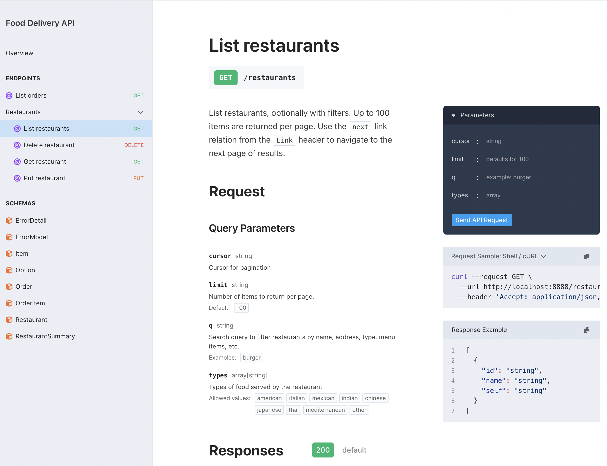
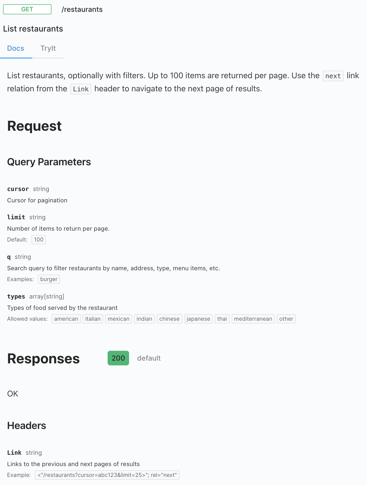
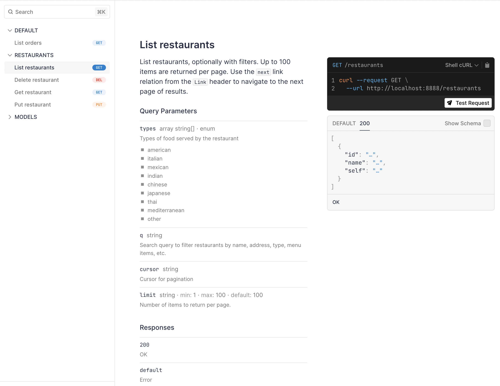
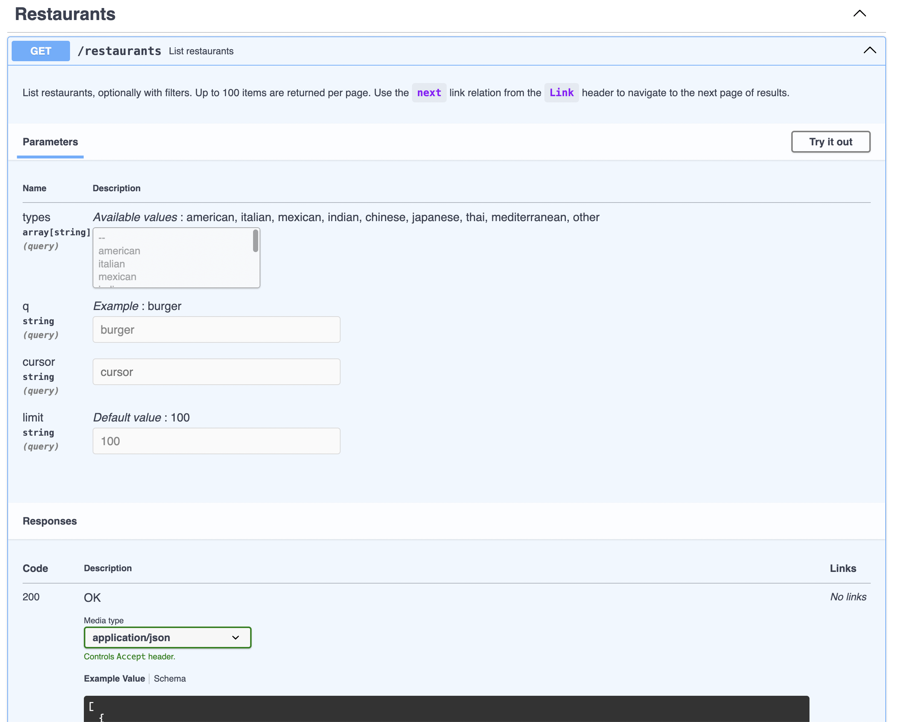

# Generated API Documentation

## Generated API Docs { .hidden }

Huma uses the OpenAPI spec to generate interactive API documentation using third-party tools. By default, [Stoplight Elements](https://stoplight.io/open-source/elements) is used to render the documentation at the API's `config.DocsPath` which defaults to `/docs`.



!!! info "Disabling the Docs"

    You can disable the built-in documentation by setting `config.DocsPath` to an empty string.

## Customizing Documentation

You can customize the generated documentation by providing your own renderer function to the API adapter or by using the underlying router directly.

### Stoplight Elements

You can customize the default docs by providing your own HTML so you can set the layout, styles, colors, etc as needed.

```go title="code.go"
router := chi.NewRouter()
config := huma.DefaultConfig("Docs Example", "1.0.0")
config.DocsPath = ""

api := humachi.New(router, config)

router.Get("/docs", func(w http.ResponseWriter, r *http.Request) {
	w.Header().Set("Content-Type", "text/html")
	// Very strict CSP so we never expose any data to the outside world
	w.Header().Set("Content-Security-Policy",
		"default-src 'none';"+
			" base-uri 'none';"+
			" connect-src 'self';"+
			" form-action 'none';"+
			" frame-ancestors 'none';"+
			" sandbox allow-same-origin allow-scripts;"+
			" script-src https://unpkg.com/;"+
			" style-src 'unsafe-inline' https://unpkg.com/;"+
			" trusted-types 'none'")
	w.Write([]byte(`<!doctype html>
<html lang="en">
  <head>
    <meta charset="utf-8" />
    <meta name="referrer" content="same-origin" />
    <meta name="viewport" content="width=device-width, initial-scale=1, shrink-to-fit=no" />
    <title>Docs Example reference</title>
    <link rel="stylesheet" href="https://unpkg.com/@stoplight/elements@9.0.12/styles.min.css" crossorigin integrity="sha384-iVQBHadsD+eV0M5+ubRCEVXrXEBj+BqcuwjUwPoVJc0Pb1fmrhYSAhL+BFProHdV" />
    <script src="https://unpkg.com/@stoplight/elements@9.0.12/web-components.min.js" crossorigin integrity="sha384-2AG+Hh93OYHuMcQJPPLM2671WnQzoHvHXh9FwbRfwMpyMLNc3++q/nJBKeVY0JMo"></script>
  </head>
  <body style="height: 100vh;">
    <elements-api
      apiDescriptionUrl="/openapi.yaml"
      router="hash"
      tryItCredentialsPolicy="same-origin"
    />
  </body>
</html>`))
})
```



### Scalar Docs

[Scalar Docs](https://github.com/scalar/scalar?tab=readme-ov-file#readme) provide a featureful and customizable API documentation experience that feels similar to Postman in your browser.

```go title="code.go"
router := chi.NewRouter()
config := huma.DefaultConfig("Docs Example", "1.0.0")
config.DocsPath = ""

api := humachi.New(router, config)

router.Get("/docs", func(w http.ResponseWriter, r *http.Request) {
	w.Header().Set("Content-Type", "text/html")
	// Very strict CSP so we never expose any data to the outside world
	w.Header().Set("Content-Security-Policy",
		"default-src 'none';"+
			" base-uri 'none';"+
			" connect-src 'self';"+
			" form-action 'none';"+
			" frame-ancestors 'none';"+
			" sandbox allow-same-origin allow-scripts;"+
			" script-src 'unsafe-eval' https://unpkg.com/;"+ // TODO: Somehow drop 'unsafe-eval'
			" style-src 'unsafe-inline' https://unpkg.com/;"+ // TODO: Somehow drop 'unsafe-inline'
			" trusted-types 'none'")
	w.Write([]byte(`<!doctype html>
<html>
  <head>
    <title>API Reference</title>
    <meta charset="utf-8" />
    <meta
      name="viewport"
      content="width=device-width, initial-scale=1" />
  </head>
  <body>
    <script
      id="api-reference"
      data-url="/openapi.json"></script>
    <script src="https://unpkg.com/@scalar/api-reference@1.39.3/dist/browser/standalone.js" crossorigin integrity="sha384-76/gvOpu0/XSY2z9BOX4MhHQJACTk0S2GW1Cwh9gRMhcf3sf7mYqKbmMA1PDl3mL"></script>
  </body>
</html>`))
})
```



### SwaggerUI

[SwaggerUI](https://github.com/swagger-api/swagger-ui#readme) is an older but proven documentation generator that is widely used in the industry. It provides a more traditional API documentation experience.

```go title="code.go"
router := chi.NewRouter()
config := huma.DefaultConfig("Docs Example", "1.0.0")
config.DocsPath = ""

api := humachi.New(router, config)

router.Get("/docs", func(w http.ResponseWriter, r *http.Request) {
	w.Header().Set("Content-Type", "text/html")
	// Very strict CSP so we never expose any data to the outside world
	w.Header().Set("Content-Security-Policy",
		"default-src 'none';"+
			" base-uri 'none';"+
			" connect-src 'self';"+
			" form-action 'none';"+
			" frame-ancestors 'none';"+
			" sandbox allow-same-origin allow-scripts;"+
			" script-src https://unpkg.com/ 'sha256-SWB2p1nUb0MJzt5MoVlrz+PWYxv53T2z7GdKFxZm9i4=';"+
			" style-src https://unpkg.com/;"+
			" trusted-types 'none'")
	w.Write([]byte(`<!DOCTYPE html>
<html lang="en">
<head>
  <meta charset="utf-8" />
  <meta name="viewport" content="width=device-width, initial-scale=1" />
  <meta name="description" content="SwaggerUI" />
  <title>SwaggerUI</title>
  <link rel="stylesheet" href="https://unpkg.com/swagger-ui-dist@5.30.2/swagger-ui.css" crossorigin integrity="sha384-++DMKo1369T5pxDNqojF1F91bYxYiT1N7b1M15a7oCzEodfljztKlApQoH6eQSKI" />
</head>
<body>
<div id="swagger-ui"></div>
<script src="https://unpkg.com/swagger-ui-dist@5.30.2/swagger-ui-bundle.js" crossorigin integrity="sha384-bBdB196maIUakX6v2F6J0XcjddQfaENm8kASsYfqTKCZua9xlYNh1AdtL18PGr0D"></script>
<script>
  window.onload = () => {
    window.ui = SwaggerUIBundle({
      url: '/openapi.json',
      dom_id: '#swagger-ui',
    });
  };
</script>
</body>
</html>`))
})
```



## Dive Deeper

-   Reference
    -   [`huma.Config`](https://pkg.go.dev/github.com/danielgtaylor/huma/v2#Config) the API config
    -   [`huma.DefaultConfig`](https://pkg.go.dev/github.com/danielgtaylor/huma/v2#DefaultConfig) the default API config
