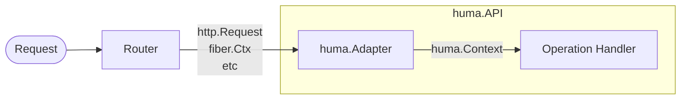

# BYOR (Bring Your Own Router)

## BYOR (Bring Your Own Router) { .hidden }

Huma is designed to be router-agnostic to enable incremental adoption in existing and new services across a large number of organizations. This means you can use any router you want, or even write your own. The only requirement is an implementation of a small [`huma.Adapter`](https://pkg.go.dev/github.com/danielgtaylor/huma/v2#Adapter) interface. This is how Huma integrates with your router.

Adapters are in the [`adapters`](https://github.com/danielgtaylor/huma/tree/main/adapters) directory and named after the router they support. Many common routers are supported out of the box (in alphabetical order):

-   [BunRouter](https://bunrouter.uptrace.dev/) via [`humabunrouter`](https://pkg.go.dev/github.com/danielgtaylor/huma/v2/adapters/humabunrouter)
-   [chi](https://github.com/go-chi/chi) via [`humachi`](https://pkg.go.dev/github.com/danielgtaylor/huma/v2/adapters/humachi)
-   [Echo](https://echo.labstack.com/) via [`humaecho`](https://pkg.go.dev/github.com/danielgtaylor/huma/v2/adapters/humaecho)
-   [Fiber](https://gofiber.io/) via [`humafiber`](https://pkg.go.dev/github.com/danielgtaylor/huma/v2/adapters/humafiber)
-   [gin](https://gin-gonic.com/) via [`humagin`](https://pkg.go.dev/github.com/danielgtaylor/huma/v2/adapters/humagin)
-   [Go 1.22+ `http.ServeMux`](https://pkg.go.dev/net/http@master#ServeMux) via [`humago`](https://pkg.go.dev/github.com/danielgtaylor/huma/v2/adapters/humago) (requires `go 1.22` or newer in `go.mod`)
-   [gorilla/mux](https://github.com/gorilla/mux) via [`humamux`](https://pkg.go.dev/github.com/danielgtaylor/huma/v2/adapters/humamux)
-   [httprouter](https://github.com/julienschmidt/httprouter) via [`humahttprouter`](https://pkg.go.dev/github.com/danielgtaylor/huma/v2/adapters/humahttprouter)

!!! info "New Adapters"

    Writing your own adapter is quick and simple, and PRs are accepted for additional adapters to be built-in.

## Chi Example

Adapters are instantiated by wrapping your router and providing a Huma configuration object which describes the API. Here is a simple example using Chi:

```go title="main.go"
import (
	"github.com/danielgtaylor/huma/v2"
	"github.com/danielgtaylor/huma/v2/adapters/humachi"
	"github.com/go-chi/chi/v5"
)

// Create your router.
router := chi.NewMux()

// Wrap the router with Huma to create an API instance.
api := humachi.New(router, huma.DefaultConfig("My API", "1.0.0"))

// Register your operations with the API.
// ...

// Start the server!
http.ListenAndServe(":8888", r)
```

For existing services using Chi v4, you can use `humachi.NewV4` instead.

## Route Groups & Base URLs

Many routers support grouping of operations under a common base URL path. This is useful for versioning APIs or grouping related operations together. Huma's router adapters can be instantiated using these route groups. You can set the `OpenAPI().Servers` slice to include the base URL path for the group, enabling the correct URLs to be generated for the docs & schemas. Here is an example:

```go title="main.go"
mux := chi.NewMux()
mux.Route("/api", func(r chi.Router) {
	config := huma.DefaultConfig("My API", "1.0.0")
	config.Servers = []*huma.Server{
		{URL: "https://example.com/api"},
	}
	api = humachi.New(r, config)

	// Register operations...
	huma.Get(api, "/demo", func(ctx context.Context, input *struct{}) (*struct{}, error) {
		// TODO: Implement me!
		return nil, nil
	})
})
http.ListenAndServe("localhost:8888", mux)
```

The OpenAPI, docs, schemas, etc will all be generated with the `/api` prefix.

```sh title="Shell"
# Call the demo operation
restish :8888/api/demo

# Get the OpenAPI
restish :8888/api/openapi.yaml
```

The following scenarios are supported:

| Server Base URL | Route Group | Register Path | Client Request & Description                                                                                                                        |
| --------------- | ----------- | ------------- | --------------------------------------------------------------------------------------------------------------------------------------------------- |
| -               | -           | `/api/demo`   | `GET /api/demo` <br/> The default simple case.                                                                                                      |
| `/api`          | -           | `/demo`       | `GET /api/demo` &rarr; `GET /demo` <br/> E.g. an API gateway which forwards requests to the service after stripping the `/api` prefix off the path. |
| `/api`          | `/api`      | `/demo`       | `GET /api/demo` <br/> Unmodified request with route groups.                                                                                         |

## Dive Deeper

The adapter converts a router-specific request context like `http.Request` or `fiber.Ctx` into the router-agnostic `huma.Context`, which is then used to call your operation's handler function.



-   Features
    -   [Registering operations](./operations.md)
-   Reference
    -   [`huma.Context`](https://pkg.go.dev/github.com/danielgtaylor/huma/v2#Context) a router-agnostic request/response context
    -   [`huma.Adapter`](https://pkg.go.dev/github.com/danielgtaylor/huma/v2#Adapter) the router-agnostic adapter interface
    -   [`huma.API`](https://pkg.go.dev/github.com/danielgtaylor/huma/v2#API) the API instance
    -   [`huma.NewAPI`](https://pkg.go.dev/github.com/danielgtaylor/huma/v2#NewAPI) creates an API instance (called by adapters)
    -   [`huma.Register`](https://pkg.go.dev/github.com/danielgtaylor/huma/v2#Register) registers new operations
    -   [`huma.OpenAPI`](https://pkg.go.dev/github.com/danielgtaylor/huma/v2#OpenAPI) configures things like the server URLs & base path
