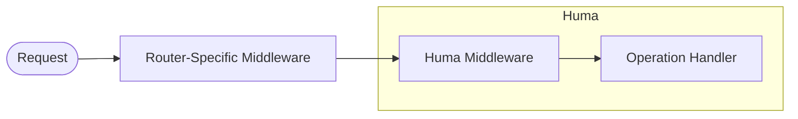

# Middleware

## Middleware { .hidden }

Huma has support for two variants of middleware:

1. Router-specific - works at the router level, i.e. before router-agnostic middleware. You can use any middleware that is implemented for your router.
2. Router-agnostic - runs in the Huma processing chain, i.e. after calls to router-specific middleware.



## Router-specific

Each router implementation has its own middlewares, you can use these as you normally would before creating the Huma API instance.

Chi router example:

```go title="code.go"
router := chi.NewMux()
router.Use(jwtauth.Verifier(tokenAuth))
api := humachi.New(router, huma.DefaultConfig("My API", "1.0.0"))
```

Fiber router example:

```go title="code.go"
app := fiber.New()
app.Use(logger.New())
api := humafiber.New(app, huma.DefaultConfig("My API", "1.0.0"))
```

!!! info "Huma v1"

    Huma v1 middleware is compatible with Chi v4, so if you use that router with Huma v2 you can continue to use the Huma v1 middleware. See [`humachi.NewV4`](https://pkg.go.dev/github.com/danielgtaylor/huma/v2/adapters/humachi#NewV4).

## Router-agnostic

You can write you own Huma middleware without any dependency to the specific router implementation. This uses the router-agnostic `huma.Context` interface, which exposes the request and response properties to your middleware.

Example:

```go title="code.go"
func MyMiddleware(ctx huma.Context, next func(huma.Context)) {
	// Call the next middleware in the chain. This eventually calls the
	// operation handler as well.
	next(ctx)

	// Set a custom header on the response *after* the operation handler
	// has finished.
	ctx.SetHeader("My-Custom-Header", "Hello, world!")
}

func NewHumaAPI() huma.API {
	// ...
	api := humachi.New(router, config)
	api.UseMiddleware(MyMiddleware)
}
```

### Cookies

You can use the `huma.Context` interface along with [`huma.ReadCookie`](https://pkg.go.dev/github.com/danielgtaylor/huma/v2#ReadCookie) or [`huma.ReadCookies`](https://pkg.go.dev/github.com/danielgtaylor/huma/v2#ReadCookies) to access cookies from middleware, and can also write cookies by adding `Set-Cookie` headers in the response:

```go
func MyMiddleware(ctx huma.Context, next func(huma.Context)) {
	// Read a cookie by name.
	sessionCookie := huma.ReadCookie(ctx, "session")
	fmt.Println(sessionCookie)

	// Read all the cookies from the request.
	cookies := huma.ReadCookies(ctx)
	fmt.Println(cookies)

	// Set a cookie in the response. Using `ctx.AppendHeader` won't overwrite
	// any existing headers, for example if other middleware might also set
	// headers or if this code were moved after the `next` call and the operation
	// might set the same header. You can also call `ctx.AppendHeader` multiple
	// times to write more than one cookie.
	cookie := http.Cookie{
		Name:  "session",
		Value: "123",
	}
	ctx.AppendHeader("Set-Cookie", cookie.String())

	// Call the next middleware in the chain. This eventually calls the
	// operation handler as well.
	next(ctx)
}
```

### Errors

If your middleware encounters an error, you can stop the processing of the next middleware or operation handler by skipping the call to `next` and writing an error response.

The [`huma.WriteErr(api, ctx, status, message, ...error)`](https://pkg.go.dev/github.com/danielgtaylor/huma/v2#WriteErr) function can be used to write nice structured error responses which respect client-driven content negotiation for marshaling:

```go title="code.go"
func MyMiddleware(ctx huma.Context, next func(ctx huma.Context)) {
	// If there is a query parameter "error=true", then return an error
	if ctx.Query("error") == "true" {
		huma.WriteErr(api, ctx, http.StatusInternalServerError,
			"Some friendly message", fmt.Errorf("error detail"),
		)
		return
	}

	// Otherwise, just continue as normal.
	next(ctx)
})
```

!!! info "Error Details"

    The [`huma.ErrorDetail`](https://pkg.go.dev/github.com/danielgtaylor/huma/v2#ErrorDetail) struct can be used to provide more information about the error, such as the location of the error and the value which was seen.

## Dive Deeper

-   Reference
    -   [`huma.Context`](https://pkg.go.dev/github.com/danielgtaylor/huma/v2#Context) a router-agnostic request/response context
    -   [`huma.Middlewares`](https://pkg.go.dev/github.com/danielgtaylor/huma/v2#Middlewares) the API instance
    -   [`huma.ReadCookie`](https://pkg.go.dev/github.com/danielgtaylor/huma/v2#ReadCookie) reads a named cookie from a request
    -   [`huma.ReadCookies`](https://pkg.go.dev/github.com/danielgtaylor/huma/v2#ReadCookies) reads cookies from a request
    -   [`huma.WriteErr`](https://pkg.go.dev/github.com/danielgtaylor/huma/v2#WriteErr) function to write error responses
    -   [`huma.API`](https://pkg.go.dev/github.com/danielgtaylor/huma/v2#API) the API instance
