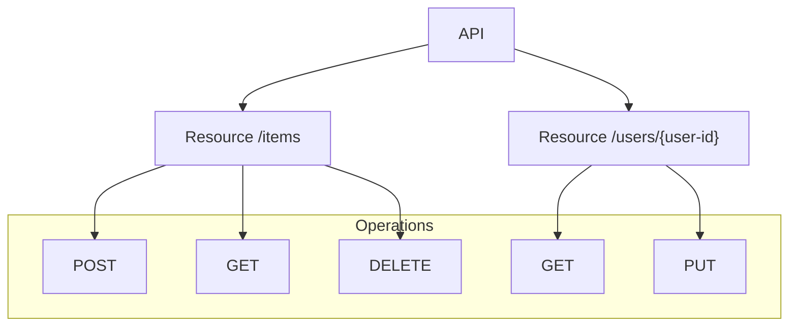
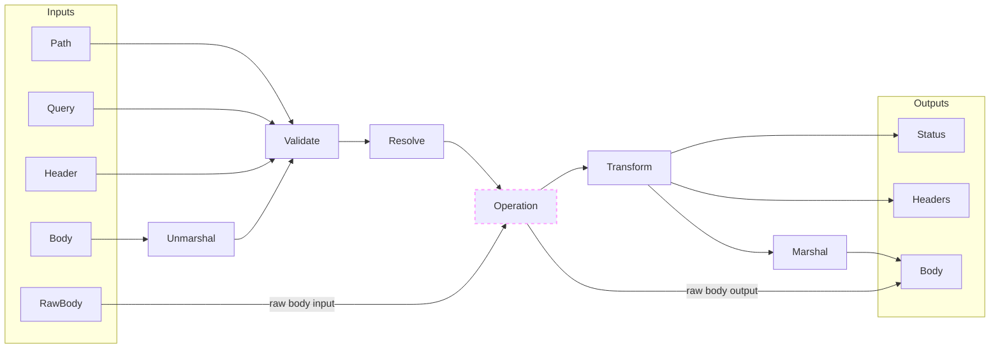

# Operations

## Operations { .hidden }

Operations are at the core of Huma. They map an HTTP method verb and resource path to a handler function with well-defined inputs and outputs. When looking at an API made up of resources, the operations correspond to the `GET`, `POST`, `PUT`, etc methods on those resources like in the example below:



Operations are created using the [`huma.Register`](https://pkg.go.dev/github.com/danielgtaylor/huma/v2#Register) function:

```go
huma.Register(api, huma.Operation{
	OperationID: "your-operation-name",
	Method:      http.MethodGet,
	Path:        "/path/to/resource/{id}",
	Summary:     "A short description of the operation",
}, func(ctx context.Context, input *YourInput) (*YourOutput, error) {
	// ... Implementation goes here ...
})
```

!!! info "REST"

    If following REST-ish conventions, operation paths should be nouns, and plural if they return more than one item. Good examples: `/notes`, `/likes`, `/users/{user-id}`, `/videos/{video-id}/stats`, etc. Huma does not enforce this or care, so RPC-style paths are also fine to use. Use what works best for you and your team.

!!! info "OperationID"

    Did you know? The `OperationID` is used to generate friendly CLI commands in [Restish](https://rest.sh/) and used when generating SDKs! It should be unique, descriptive, and easy to type.

    ```sh title="Terminal"
    $ restish your-api your-operation-name --param=value ...
    ```

### Convenience Methods

A number of convenience methods are provided if you don't want to use the `huma.Operation` struct directly. The following are available:

-   `huma.Get`
-   `huma.Post`
-   `huma.Put`
-   `huma.Patch`
-   `huma.Delete`

These methods are equivalent to using `huma.Register` with the `Method` field set to the corresponding HTTP method, and they generate the operation ID for you based on the path. For example:

```go title="code.go"
huma.Get(api, "/things/{thing-id}", func(ctx context.Context, input *YourInput) (*YourOutput, error) {
    // ... Implementation goes here ...
})
```

In the example above, the generated operation ID is `get-things-by-thing-id` with a summary of `Get things by id`. To customize these, override `huma.GenerateOperationID(method, path string, response any)` for operation IDs and `huma.GenerateSummary(method, path string, response any)` for summaries.

This makes it easy to get started, particularly if coming from other frameworks, and you can simply switch to using `huma.Register` if/when you need to set additional fields on the operation.

## Handler Function

The operation handler function _always_ has the following generic format, where `Input` and `Output` are custom structs defined by the developer that represent the entirety of the request (path/query/header/cookie params & body) and response (headers & body), respectively:

```go title="code.go"
func(context.Context, *Input) (*Output, error)
```

There are many options available for configuring OpenAPI settings for the operation, and custom extensions are supported as well. See the [`huma.Operation`](https://pkg.go.dev/github.com/danielgtaylor/huma/v2#Schema) struct for more details.

## Input & Output Models

Inputs and outputs are **always** structs that represent the entirety of the incoming request or outgoing response. This is a deliberate design decision to make it easier to reason about the data flow in your application. It also makes it easier to share code as well as generate documentation and SDKs.

If your operation has no inputs or outputs, you can use a pointer to an empty struct `*struct{}` when registering it.

```go title="code.go"
func(ctx context.Context, input *struct{}) (*struct{}, error) {
    // Successful response example, defaults to HTTP 204 No Content
    return nil, nil
}
```

## Request Flow

A request flowing into the API goes through a number of steps before reaching your operation handler. The following diagram shows the flow of a request through the system, from request inputs like path/query/header parameters and the request body, through validation, the operation handler, and how outputs are sent in the response.



`Unmarshal`

: Read the raw bytes of the request body (e.g. JSON) into a Go structure.

[`Validate`](./request-validation.md)

: Check constraints on the inputs (e.g. `minimum`, `maxLength`, etc) and report failures.

[`Resolve`](./request-resolvers.md)

: Run custom validation code and report failures.

`Operation`

: Your operation handler function. Business logic goes here. It returns either your response structure or an error.

[`Transform`](./response-transformers.md)

: Modify the structured response data on the fly before marshaling it to bytes.

[`Marshal`](./response-serialization.md)

: Convert the structured response data into bytes (e.g. JSON).

Read on to learn about how each of these steps works.

## Dive Deeper

-   Tutorial
    -   [Your First API](../tutorial/your-first-api.md#operation) includes registering an operation
-   Reference
    -   [`huma.Register`](https://pkg.go.dev/github.com/danielgtaylor/huma/v2#Register) registers new operations
    -   [`huma.Operation`](https://pkg.go.dev/github.com/danielgtaylor/huma/v2#Operation) the operation
-   External Links
    -   [OpenAPI 3.1 Operation Object](https://spec.openapis.org/oas/v3.1.0#operation-object)
