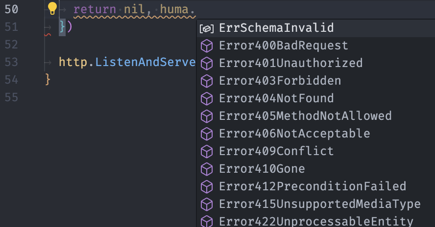
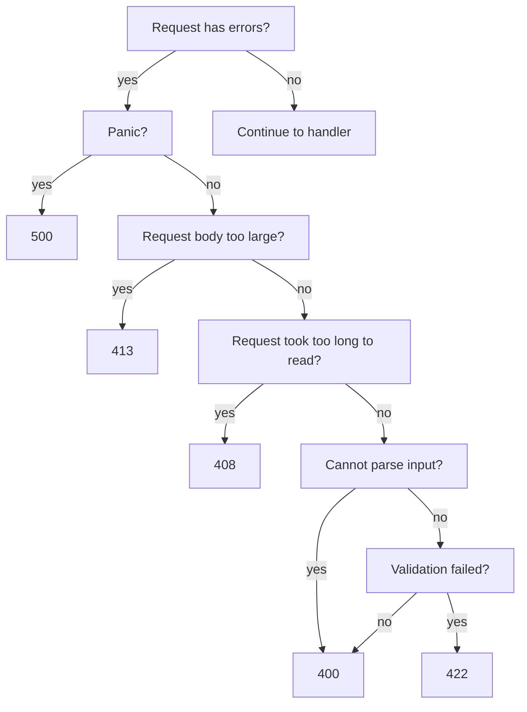

# Response Errors

## Returning HTTP Errors

Handler functions can return errors instead of a successful response. There are a number of utility functions to return common HTTP errors:

```go title="code.go" hl_lines="7-8"
huma.Register(api, huma.Operation{
		OperationID: "get-thing",
		Method:      http.MethodGet,
		Path:        "/things/{thing-id}",
		Summary:     "Get a thing by ID",
}, func(ctx context.Context, input ThingRequest) (*struct{}, error) {
		// Return a 404 Not Found error
		return nil, huma.Error404NotFound("thing not found")
}
```

The error functions are named like `Error{code}{name}` and accept a message and error details which can provide more information back to the user. For example, `huma.Error400BadRequest(msg string, errs ...error)`. Editors like VSCode should automatically show the available errors as you type:



!!! warning "Default Error Response"

    If the error returned has no associated HTTP status code, for example you use `fmt.Errorf("my error")`, then the default error response code is `500 Internal Server Error`. Use [`huma.NewError`](https://pkg.go.dev/github.com/danielgtaylor/huma/v2#NewError) to return an error with a custom status code.

## Error Model

Errors use [RFC 9457 Problem Details for HTTP APIs](https://tools.ietf.org/html/rfc9457) with a content type like `application/problem+json` and return a structure that looks like:

```http title="HTTP Response"
HTTP/2.0 422 Unprocessable Entity
Cache-Control: private
Content-Length: 241
Content-Type: application/problem+json
Link: </schemas/ErrorModel.json>; rel="describedBy"

{
  "$schema": "https://api.rest.sh/schemas/ErrorModel.json",
  "status": 422,
  "title": "Unprocessable Entity",
  "detail": "validation failed",
  "errors": [
    {
      "location": "body.title",
      "message": "expected string",
      "value": true
    },
    {
      "location": "body.reviews",
      "message": "unexpected property",
      "value": {
        "reviews": 5,
        "title": true
      }
    }
  ]
}
```

The `errors` field is optional and may contain more details about which specific errors occurred. See [`huma.ErrorModel`](https://pkg.go.dev/github.com/danielgtaylor/huma/v2#ErrorModel) for more details.

To display a `location`, `message`, and `value` in the errors array, use the [`huma.ErrorDetail`](https://pkg.go.dev/github.com/danielgtaylor/huma/v2#ErrorDetail) struct. If you need to wrap this with custom logic for any reason, you can implement the [`huma.ErrorDetailer`](https://pkg.go.dev/github.com/danielgtaylor/huma/v2#ErrorDetailer) interface.

### Exhaustive Errors

It is recommended to return exhaustive errors whenever possible to prevent user frustration with having to keep retrying a bad request and getting back a different error.

Input parameters validation, body validation, resolvers, etc all support returning exhaustive errors. Because of this, it's preferable to use them over custom error logic in your operation handler.

## Error Status Codes

While every attempt is made to return exhaustive errors within Huma, each individual response can only contain a single HTTP status code. The following chart describes which codes get returned and when:



This means it is possible to, for example, get an HTTP `408 Request Timeout` response that _also_ contains an error detail with a validation error for one of the input headers. Since request timeout has higher priority, that will be the response status code that is returned.

## Error Headers

Middleware can be used to add headers to all responses, e.g. for cache control, rate limiting, etc. For headers specific to errors or specific handler error responses, you can wrap the error with additional headers as needed:

```go title="code.go" hl_lines="1-3"
return nil, huma.ErrorWithHeaders(
	huma.Error404NotFound("thing not found"),
	http.Header{
		"Cache-Control": {"no-store"},
	},
)
```

It is safe to call `huma.ErrorWithHeaders` multiple times, and all the passed headers will be appended to any existing ones.

Any error which satisfies the `huma.HeadersError` interface will have the headers added to the response.

## Custom Errors

It is possible to provide your own error model and have the built-in error utility functions use that model instead of the default one. This is useful if you want to provide more information in your error responses or your organization has requirements around the error response structure.

This is accomplished by defining your custom model as a [`huma.StatusError`](https://pkg.go.dev/github.com/danielgtaylor/huma/v2#StatusError) and then overriding the built-in [`huma.NewError`](https://pkg.go.dev/github.com/danielgtaylor/huma/v2#NewError) function:

```go title="code.go" hl_lines="1-13 16-26 36"
type MyError struct {
	status  int
	Message string   `json:"message"`
	Details []string `json:"details,omitempty"`
}

func (e *MyError) Error() string {
	return e.Message
}

func (e *MyError) GetStatus() int {
	return e.status
}

func main() {
	huma.NewError = func(status int, message string, errs ...error) huma.StatusError {
		details := make([]string, len(errs))
		for i, err := range errs {
			details[i] = err.Error()
		}
		return &MyError{
			status:  status,
			Message: message,
			Details: details,
		}
	}

	router := chi.NewMux()
	api := humachi.New(router, huma.DefaultConfig("My API", "1.0.0"))

	huma.Register(api, huma.Operation{
		OperationID: "get-error",
		Method:      http.MethodGet,
		Path:        "/error",
	}, func(ctx context.Context, i *struct{}) (*struct{}, error) {
		return nil, huma.Error404NotFound("not found", fmt.Errorf("some-other-error"))
	})

	http.ListenAndServe(":8888", router)
}
```

To change the default content type that is returned, you can also implement the [`huma.ContentTypeFilter`](https://pkg.go.dev/github.com/danielgtaylor/huma/v2#ContentTypeFilter) interface.

## Dive Deeper

-   Reference
    -   [`huma.ErrorModel`](https://pkg.go.dev/github.com/danielgtaylor/huma/v2#ErrorModel) the default error model
    -   [`huma.ErrorDetail`](https://pkg.go.dev/github.com/danielgtaylor/huma/v2#ErrorDetail) describes location & value of an error
    -   [`huma.StatusError`](https://pkg.go.dev/github.com/danielgtaylor/huma/v2#StatusError) interface for custom errors
    -   [`huma.HeadersError`](https://pkg.go.dev/github.com/danielgtaylor/huma/v2#HeadersError) interface for errors with headers
    -   [`huma.ContentTypeFilter`](https://pkg.go.dev/github.com/danielgtaylor/huma/v2#ContentTypeFilter) interface for custom content types
-   External Links
    -   [HTTP Status Codes](https://developer.mozilla.org/en-US/docs/Web/HTTP/Status)
    -   [RFC 9457](https://tools.ietf.org/html/rfc9457) Problem Details for HTTP APIs
