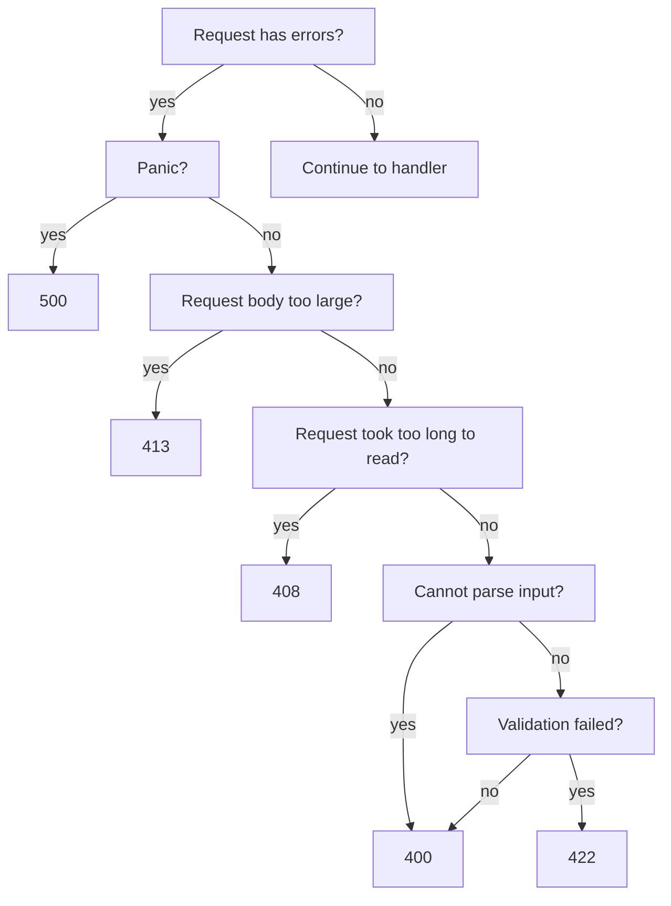

# Response Outputs

Responses can have an optional status code, headers, and/or body. Like inputs, they use standard Go structs which describe the entirety of the response.

## Status Code

Huma uses the following default response status codes:

-   `200` for responses with bodies
-   `204` for responses without a body

You can override this behavior in two ways. The first, is by setting [`huma.Operation`](https://pkg.go.dev/github.com/danielgtaylor/huma/v2#Operation) `DefaultStatus` field at operation registration time.

```go title="code.go"
// Register an operation with a default status code of 201.
huma.Register(api, huma.Operation{
	OperationID:  "create-thing",
	Method:       http.MethodPost,
	Path:         "/things",
	Summary:      "Create a thing",
	DefaultStatus: 201,
}, func(ctx context.Context, input ThingRequest) (*struct{}, error) {
	// Do nothing...
	return nil, nil
}
```

Lastly, if the response code needs to be **dynamic**, you can use the special `Status` field in your response struct. This is not recommended, but is available if needed.

```go title="code.go"
type ThingResponse struct {
	Status int
	Body   Thing
}

huma.Register(api, huma.Operation{
	OperationID:  "get-thing",
	Method:       http.MethodGet,
	Path:         "/things/{thing-id}",
	Summary:      "Get a thing by ID",
}, func(ctx context.Context, input ThingRequest) (*struct{}, error) {
	// Create a response and set the dynamic status
	resp := &ThingResponse{}
	if input.ID < 500 {
		resp.Status = 200
	} else {
		// This is a made-up status code used for newer things.
		resp.Status = 250
	}
	return resp, nil
}
```

!!! info "Dynamic Status"

    It is much more common to set the default status code than to need a `Status` field in your response struct!

## Headers

Headers are set by fields on the response struct. Here are the available tags:

| Tag      | Description                 | Example                  |
| -------- | --------------------------- | ------------------------ |
| `header` | Name of the response header | `header:"Authorization"` |

Here's an example of a response with several headers of different types:

```go title="code.go"
// Example struct with several headers
type MyOutput struct {
	ContentType  string    `header:"Content-Type"`
	LastModified time.Time `header:"Last-Modified"`
	MyHeader     int       `header:"My-Header"`
}
```

## Body

The special struct field `Body` will be treated as the response body and can refer to any other type or you can embed a struct or slice inline. Use a type of `[]byte` to bypass [serialization](/features/response-serialization/). A default `Content-Type` header will be set if none is present, selected via client-driven content negotiation with the server based on the registered serialization types.

Example:

```go title="code.go"
type MyOutput struct {
	Status       int
	LastModified time.Time `header:"Last-Modified"`
	Body         MyBody
}
```

## Exhaustive Errors

Errors use [RFC 7807](https://tools.ietf.org/html/rfc7807) Problem Details for HTTP APIs and return a structure that looks like:

```http title="HTTP Response"
HTTP/2.0 422 Unprocessable Entity
Cache-Control: private
Content-Length: 241
Content-Type: application/problem+json
Link: </schemas/ErrorModel.json>; rel="describedBy"

{
  "$schema": "https://api.rest.sh/schemas/ErrorModel.json",
	"status": 422,
  "title": "Unprocessable Entity",
  "detail": "validation failed",
  "errors": [
    {
      "location": "body.title",
      "message": "expected string",
      "value": true
    },
    {
      "location": "body.reviews",
      "message": "unexpected property",
      "value": {
        "reviews": 5,
        "title": true
      }
    }
  ]
}
```

The `errors` field is optional and may contain more details about which specific errors occurred.

It is recommended to return exhaustive errors whenever possible to prevent user frustration with having to keep retrying a bad request and getting back a different error. Input parameters validation, body validation, resolvers, etc all support returning exhaustive errors.

While every attempt is made to return exhaustive errors within Huma, each individual response can only contain a single HTTP status code. The following chart describes which codes get returned and when:



This means it is possible to, for example, get an HTTP `408 Request Timeout` response that _also_ contains an error detail with a validation error for one of the input headers. Since request timeout has higher priority, that will be the response status code that is returned.

## Dive Deeper

-   Reference
    -   [`huma.Register`](https://pkg.go.dev/github.com/danielgtaylor/huma/v2#Register) registers new operations
    -   [`huma.Operation`](https://pkg.go.dev/github.com/danielgtaylor/huma/v2#Operation) the operation
-   External Links
    -   [HTTP Status Codes](https://developer.mozilla.org/en-US/docs/Web/HTTP/Status)
    -   [RFC 7807](https://tools.ietf.org/html/rfc7807) Problem Details for HTTP APIs
