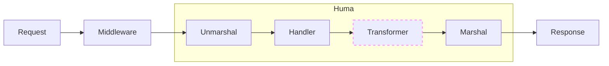

# Response Transformers

## Response Transformers { .hidden }

Router middleware operates on router-specific request & response objects whose bodies are `[]byte` slices or streams. Huma operations operate on specific struct instances. Sometimes there is a need to generically operate on structured response data _after_ the operation handler has run but _before_ the response is serialized to bytes. This is where response transformers come in.



Response transformers enable you to modify the response on the fly. For example, you could add a `Link` header to the response to indicate that the response body is described by a JSON Schema. This is done by implementing the [`huma.Transformer`](https://pkg.go.dev/github.com/danielgtaylor/huma/v2#Transformer) interface and registering it with the API.

A simple for-fun example might look something like this:

```go title="code.go"
// FieldSelectTransform is an example of a transform that can use an input
// header value to modify the response on the server, providing a GraphQL-like
// way to send only the fields that the client wants over the wire.
func FieldSelectTransform(ctx Context, status string, v any) (any, error) {
	if fields := ctx.Header("Fields"); fields != "" {
		// Ugh this is inefficient... consider other ways of doing this :-(
		var tmp any
		b, _ := json.Marshal(v)
		json.Unmarshal(b, &tmp)
		result, _, err := shorthand.GetPath(fields, tmp, shorthand.GetOptions{})
		return result, err
	}
	return v, nil
}
```

This could be used like so:

```sh title="Terminal"
$ restish example.com/things/1 -H 'Fields: {id, tag_names: tags[].name}'
```

See the [`huma.SchemaLinkTransformer`](https://pkg.go.dev/github.com/danielgtaylor/huma/v2#SchemaLinkTransformer) for a more real-world in-depth example.

## Dive Deeper

-   Reference
    -   [`huma.Transformer`](https://pkg.go.dev/github.com/danielgtaylor/huma/v2#Transformer) response transformers
    -   [`huma.Config`](https://pkg.go.dev/github.com/danielgtaylor/huma/v2#Config) the API config
