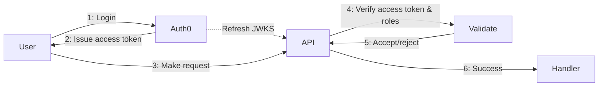
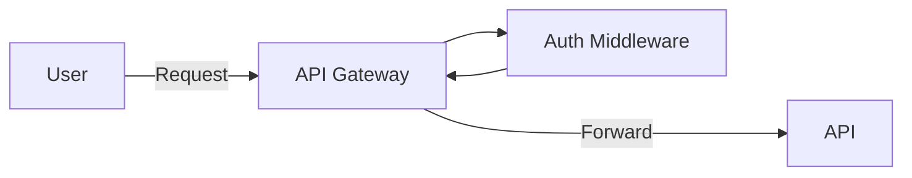

## Overview

[OAuth 2.0](https://oauth.net/2/) is a popular open standard authorization framework that enables you to verify that incoming requests are authorized to use your API.

There are three main pieces to using OAuth 2.0 with Huma:

1. Issue an access token to a client application
2. Document the auth scheme and required permissions
3. Authorize incoming requests

## Issue an Access Token

Huma does not provide any built-in access token issuing functionality. Instead, you can use any existing library or service to issue tokens. For simplicity's sake, we will assume you are using a third-party service for managing users and issuing tokens, like [Auth0](https://auth0.com/) or [Okta](https://www.okta.com/). A simplified flow chart for OAuth2.0 authorization looks something like this:



The access token may be issued in different flavors & formats, but for the remainder of this document we will assume they are [JWTs](https://jwt.io/).

You will configure the third-party service to issue access token from OAuth 2.0 flows like Authorization Code or Client Credentials (among others) and will be given e.g. authorization and token URLs, which will be used later in the OpenAPI and to configure clients to fetch access tokens.

If **not** using a third-party service, you will need to set up a signing authority, publish your own JWKS, and issue short-lived tokens yourself. This is outside the scope of this guide, but take a look at [github.com/lestrrat-go/jwx](https://github.com/lestrrat-go/jwx) for a library that can help.

## Document the Auth Scheme in OpenAPI

Next, you need to document the auth scheme in your OpenAPI document. This is done using the `SecuritySchemes` component. Here is an example defining an OAuth 2.0 Authorization Code flow with the URLs mentioned above and a couple of defined scopes:

```go title="main.go"
router := chi.NewMux()

config := huma.DefaultConfig("My API", "1.0.0")
config.Components.SecuritySchemes = map[string]*huma.SecurityScheme{
	// Example Authorization Code flow.
	"myAuth": {
		Type: "oauth2",
		Flows: &huma.OAuthFlows{
			AuthorizationCode: &huma.OAuthFlow{
				AuthorizationURL: "https://example.com/oauth/authorize",
				TokenURL:         "https://example.com/oauth/token",
				Scopes: map[string]string{
					"scope1": "Scope 1 description...",
					"scope2": "Scope 2 description...",
				},
			},
		},
	},

	// Example alternative describing the use of JWTs without documenting how
	// they are issued or which flows might be supported. This is simpler but
	// tells clients less information.
	"anotherAuth": {
		Type:         "http",
		Scheme:       "bearer",
		BearerFormat: "JWT",
	},
}

api := humachi.New(router, config)
```

When registering your operation you can refer to the auth scheme and required scopes for that operation:

```go title="main.go" hl_lines="6-8"
huma.Register(api, huma.Operation{
	OperationID: "get-greeting",
	Summary:     "Get a greeting",
	Method:      http.MethodGet,
	Path:        "/greeting/{name}",
	Security: []map[string][]string{
		{"myAuth": {"scope1"}},
	},
}, func(ctx context.Context, input *GreetingInput) (*GreetingOutput, error) {
	// TODO: operation implementation goes here
	return nil, nil
})
```

!!! Warning

    So far, the code above is only documenting the authorization scheme and required scopes, but does not actually authorize incoming requests. The next section will explain how to achieve the latter.

## Authorize Incoming Requests

Where authentication & authorization happen depends on how your service is set up. In some scenarios you may have an API gateway that handles auth and forwards requests to your service. In other scenarios you may want to handle auth in your service.

### API Gateway Auth

In an API gateway scenario, you typically configure the gateway to check the `Authorization` header for a token and validate it against the JWKS URL. If the token is valid, then the gateway will forward the request to your API service. There are many such gateways (e.g. [Traefik](https://traefik.io/traefik/), [Istio](https://istio.io/), etc) and ways of configuring them, but the general idea is similar between them:



In this case and depending on your security requirements, you may be able to skip this section since all incoming requests to your API will have already been vetted by the gateway. In this scenario, the Huma code from the previous section serves mostly as documentation for your clients.

### Huma Auth Middleware

Huma provides middleware functionality that can be used to authorize incoming requests within the API service itself. Here is an example that will check the `Authorization` header for a token and validate it against the JWKS URL given by your JWT issuer (e.g. Auth0/Okta). It will also check that the token has the required scopes for the operation, if any are defined.

```go title="main.go"
import (
	"github.com/lestrrat-go/jwx/v2/jwk"
	"github.com/lestrrat-go/jwx/v2/jwt"
)

// NewJWKSet creates an auto-refreshing key set to validate JWT signatures.
func NewJWKSet(jwkUrl string) jwk.Set {
    jwkCache := jwk.NewCache(context.Background())

    // register a minimum refresh interval for this URL.
    // when not specified, defaults to Cache-Control and similar resp headers
    err := jwkCache.Register(jwkUrl, jwk.WithMinRefreshInterval(10*time.Minute))
    if err != nil {
        panic("failed to register jwk location")
    }

    ctx, cancel := context.WithTimeout(context.Background(), 10*time.Second)
    defer cancel()

    // fetch once on application startup
    _, err = jwkCache.Refresh(ctx, jwkUrl)
    if err != nil {
        panic("failed to fetch on startup")
    }
    // create the cached key set
    return jwk.NewCachedSet(jwkCache, jwkUrl)
}

// NewAuthMiddleware creates a middleware that will authorize requests based on
// the required scopes for the operation.
func NewAuthMiddleware(api huma.API, jwksURL string) func(ctx huma.Context, next func(huma.Context)) {
	keySet := NewJWKSet(jwksURL)

	return func(ctx huma.Context, next func(huma.Context)) {
		var anyOfNeededScopes []string
		isAuthorizationRequired := false
		for _, opScheme := range ctx.Operation().Security {
			var ok bool
			if anyOfNeededScopes, ok = opScheme["myAuth"]; ok {
				isAuthorizationRequired = true
				break
			}
		}

		if !isAuthorizationRequired {
			next(ctx)
			return
		}

		token := strings.TrimPrefix(ctx.Header("Authorization"), "Bearer ")
		if len(token) == 0 {
			huma.WriteErr(api, ctx, http.StatusUnauthorized, "Unauthorized")
			return
		}

		// Parse and validate the JWT.
		parsed, err := jwt.ParseString(token,
			jwt.WithKeySet(keySet),
			jwt.WithValidate(true),
			jwt.WithIssuer("my-issuer"),
			jwt.WithAudience("my-audience"),
		)
		if err != nil {
			huma.WriteErr(api, ctx, http.StatusUnauthorized, "Unauthorized")
			return
		}

		// Ensure the claims required for this operation are present.
		scopes, _ := parsed.Get("scopes")
		if scopes, ok := scopes.([]string); ok {
			for _, scope := range scopes {
				if slices.Contains(anyOfNeededScopes, scope) {
					next(ctx)
					return
				}
			}
		}

		huma.WriteErr(api, ctx, http.StatusForbidden, "Forbidden")
	}
}
```

Lastly, when configuring your API, be sure to include this middleware:

```go title="main.go"
api.UseMiddleware(NewAuthMiddleware(api, "https://example.com/.well-known/jwks.json"))
```

### Supporting different Token Formats

As mentioned previously, the Oauth2.0 standard does not specify the format of the access token - it merely defines how to get one. Although JWT is a very popular format, a given OAuth2.0 service or library may issue access token in different formats. The gist of what is outlined above should be adaptable to support such tokens as well, but will obviously require different methods for validation and information extraction. In the case of opaque tokens, additional interaction with an IAM server may be required inside the middleware, e.g. calling an introspection endpoint.

## Optional: Client Auto-Configuration

Some clients like [Restish](https://rest.sh/) support [OpenAPI-based auth auto-configuration](https://rest.sh/#/openapi?id=autoconfiguration). This means that you can configure your client to fetch the OpenAPI document and automatically configure itself to use the correct auth mechanism. This is done by adding the `x-cli-config` extension to the OpenAPI:

```go title="main.go"
config.Extensions["x-cli-config"] = huma.AutoConfig{ /* ... */ }
```
