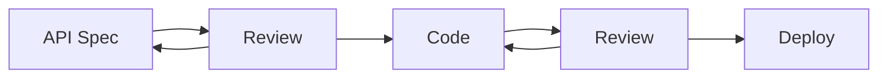
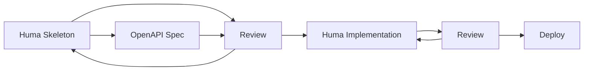

# What About Design First?

## Introduction

Design first is an API methodology that involves writing the API specification before writing any code. This is often presented in contrast to code first, where you write the code first and then generate the API specification from the code.



## Benefits

Design first enables you to think through the API, its use cases, and the big picture before just slapping together some code. It enables quick feedback and iteration on the API design.

## False Dichotomy

Fortunately, the "design-first" vs. "code-first" dichotomy is a false one. You can do both at the same time! In fact, Huma is designed to enable this by providing a way to write the skeleton code without any operation handler implementations which can be reviewed independently from the handlers.



## Example

Here's an example of part of the popular Pet Store API written as a skeleton in Huma, ready for review & iteration either by reviewing the code or by generating the API specification and reviewing that.

```go title="main.go"
package main

import (
	"context"
	"fmt"

	"github.com/danielgtaylor/huma/v2"
	"github.com/danielgtaylor/huma/v2/adapters/humachi"
	"github.com/danielgtaylor/huma/v2/humacli"
	"github.com/go-chi/chi/v5"
	"github.com/spf13/cobra"
)

type Category struct {
	ID   int    `json:"id" example:"1" doc:"Category ID"`
	Name string `json:"name" example:"Cats" doc:"Category name"`
}

type Tag struct {
	ID   int    `json:"id" example:"1" doc:"Tag ID"`
	Name string `json:"name" example:"cute" doc:"Tag name"`
}

type Pet struct {
	ID        int       `json:"id" example:"1" doc:"Pet ID"`
	Category  *Category `json:"category" doc:"Category that the pet belongs to"`
	Name      string    `json:"name" example:"Fluffy" doc:"Pet name"`
	PhotoURLs []string  `json:"photoUrls" example:"https://example.com/fluffy.jpg" doc:"Photo URLs for the pet"`
	Tags      []Tag     `json:"tags" example:'["cute"]' doc:"Tags for the pet"`
	Status    string    `json:"status" example:"available" doc:"Pet status" enum:"available,pending,sold"`
}

type PetID struct {
	ID int `path:"petId" example:"1" doc:"Pet ID"`
}

func main() {
	var api huma.API

	cli := humacli.New(func(hooks humacli.Hooks, options *struct{}) {
		router := chi.NewMux()
		api := humachi.New(router, huma.DefaultConfig("Pet Store", "1.0.0"))

		huma.Register(api, huma.Operation{
			OperationID: "post-pet",
			Method:      "POST",
			Path:        "/pet",
			Summary:     "Add a new pet",
		}, func(ctx context.Context, input *struct {
			Body Pet
		}) (*struct{}, error) {
			return nil, nil
		})

		huma.Register(api, huma.Operation{
			OperationID: "get-pet",
			Method:      "GET",
			Path:        "/pet/{petId}",
			Summary:     "Get a pet",
		}, func(ctx context.Context, input *PetID) (*struct {
			Body Pet
		}, error) {
			return nil, nil
		})

		huma.Register(api, huma.Operation{
			OperationID: "find-pet-by-status",
			Method:      "GET",
			Path:        "/pet/findByStatus",
			Summary:     "Find a pet by status",
		}, func(ctx context.Context, input *struct {
			Status string `path:"status" example:"available" doc:"Status to filter by" enum:"available,pending,sold"`
		}) (*struct {
			Body []Pet
		}, error) {
			return nil, nil
		})
	})

	cli.Root().AddCommand(&cobra.Command{
		Use: "openapi",
		Run: func(cmd *cobra.Command, args []string) {
			b, err := api.OpenAPI().MarshalJSON()
			if err != nil {
				panic(err)
			}
			fmt.Println(string(b))
		},
	})

	cli.Run()
}
```
